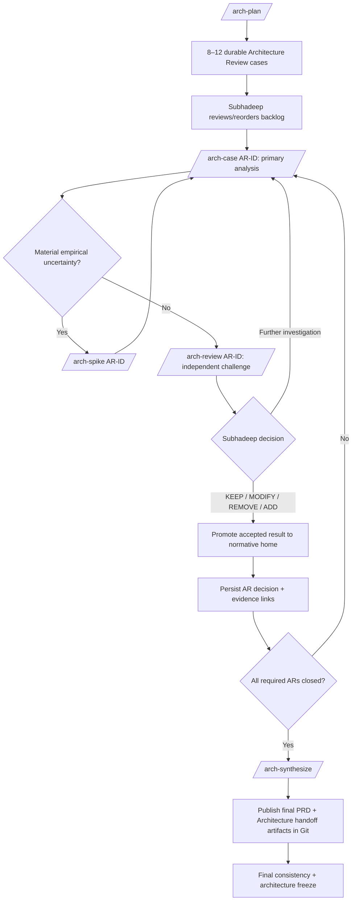

# SubhForge v0.2.0 — Architecture Review Tooling

> Document authority and stable-section policy: see `design/README.md`.

> **Temporary review infrastructure:** this document owns the one-time architecture-review execution machinery that lets SubhForge run the review through durable `/arch-*` capabilities instead of relying on chat history.
>
> It is **not** product architecture and is **not** a permanent runtime dependency.
>
> Durable AR questions/evidence/decisions live in `V0.2-ARCHITECTURE-REVIEW.md`. Final accepted rules are promoted into `V0.2-ARCHITECTURE.md` or `V0.2-WORKFLOW-CONTRACTS.md`.

## 1. Purpose

The Architecture Fitness Review must be resumable from durable state.

The anti-pattern is:

```text
long chat
→ reasoning exists only in conversation history
→ context is lost / compressed / repeated
→ review decision cannot be reproduced cleanly
```

The intended model is:

```text
AR-ID
→ durable review record
→ bounded review capability
→ persisted evidence / next action
→ later resume from AR-ID
```

A chat conversation may explain or question a result, but **chat is never the review state store**.

---

## 2. Architecture Review Capability Model

| Review agent / capability | Responsibility | Authority boundary | Durable input/output | Default model | Grill direction |
|---|---|---|---|---|---|
| **Architecture Review Planner** | Build/refine the bounded AR backlog from the accepted baseline and known risks | May create/reorder review cases; cannot change product/workflow architecture | Reads architecture/workflow/qualification baseline; writes AR backlog/status in `V0.2-ARCHITECTURE-REVIEW.md` | GPT-5.6 Sol High | **BI** — Agent may challenge scope/priority; Subhadeep may challenge rationale |
| **Architecture Case Analyst** | Work one `AR-ID`: problem, invariant, failure mode, options, trade-offs, evidence and recommendation | Analysis only; cannot promote its own recommendation into accepted architecture | Reads one AR + relevant authority/code/evidence; persists case analysis and proposed decision | Sol Medium for LOW/MEDIUM; Sol High for HIGH/CRITICAL | **BI** — Agent may ask bounded architecture-decision questions; Subhadeep may question reasoning |
| **Architecture Spike Executor** | Run one bounded experiment where empirical evidence is needed | POC only; no production SubhForge mutation | Reads AR hypothesis; writes under `poc/architecture-review/<AR-ID>/` plus evidence reference/result in AR record | DeepSeek default; Sol escalation if bounded spike cannot complete reliably | **UNI — Subhadeep → Agent**; spike does not interrogate product intent |
| **Independent Architecture Co-Analyst / Reviewer** | Develop an independent architecture analysis and alternative recommendation, then challenge the primary case | Read-only co-architecture/challenge; findings and proposals are evidence, never authority | Receives bounded AR packet without primary model reasoning transcript; writes alternative options/trade-offs/recommendation plus structured challenge into the AR record | Claude Sonnet LOW/MEDIUM; Claude Opus HIGH/CRITICAL via Claude Code + Pro | **UNI — Subhadeep → Agent** |
| **Architecture Review Synthesizer** | Check cross-AR consistency, unresolved contradictions and implementation implications before freeze | Synthesis/recommendation only; cannot self-approve architecture | Reads closed AR records + owning normative docs; writes synthesis/freeze readiness into review doc | GPT-5.6 Sol High | **BI** — may raise final consistency questions; Subhadeep owns decisions |
| **Review State Controller** | Deterministically persist/resume AR state, validate required fields, and route next review action | Mechanical state only; cannot decide architecture | Reads/writes AR status/evidence references/next action | Deterministic helper; Luna only if explanation is useful | **UNI — Subhadeep → capability** |

### Grill direction legend

- **BI** — both Subhadeep and the review agent may initiate bounded questioning.
- **UNI — Subhadeep → Agent/Capability** — Subhadeep may ask/challenge; the capability does not initiate product/architecture interrogation.
- Model choice never changes authority.

---

## 3. Review Commands / Entry Points

### `/arch-plan`

Purpose:

- inspect accepted v0.2 baseline;
- create/refine approximately **8–12 meaningful AR cases**;
- assign risk;
- identify expected evidence;
- identify candidate spikes;
- persist the backlog in `V0.2-ARCHITECTURE-REVIEW.md`.

It must not silently omit an existing open AR.

### `/arch-case AR-ID`

Purpose:

- work one durable architecture-review case;
- reconstruct only the bounded context required for that AR;
- persist analysis directly into the AR record;
- end with one of:
  - `READY_FOR_INDEPENDENT_REVIEW`;
  - `SPIKE_REQUIRED`;
  - `HUMAN_DECISION_REQUIRED`;
  - `FURTHER_INVESTIGATION`.

It must never depend on remembered chat history to know what the case is.

### `/arch-spike AR-ID`

Purpose:

- answer one material empirical uncertainty;
- keep experimental code under `poc/architecture-review/<AR-ID>/`;
- leave production SubhForge code untouched;
- persist hypothesis, method, result, limitations and evidence reference back to the AR.

Default limit: one normal working session per spike unless the AR explicitly records why more evidence is required.

### `/arch-review AR-ID`

Purpose:

- perform an independent Claude co-architecture analysis and challenge after the primary ChatGPT case analysis;
- receive the AR artifact + governing authority + evidence, **not** the primary author's hidden reasoning trail;
- develop its own viable options, trade-offs and recommendation rather than being limited to defect-finding;
- look for contradiction, missed failure modes, complexity inflation, unjustified assumptions and weaker alternatives;
- persist the alternative analysis and structured challenge as evidence.

This expands the existing bounded `/arch-review` handoff; it does not add a second Claude call by default. Co-analysis/review never decides the AR.

### `/arch-synthesize`

Purpose:

- run after required ARs are closed or explicitly dispositioned;
- verify decisions are coherent together;
- detect contradictory cross-AR outcomes;
- identify required updates to Architecture, Workflow Contracts, Qualification and Timeline;
- produce final freeze-readiness synthesis for Subhadeep;
- produce the two final implementation handoff artifacts:
  - `docs/prd/SUBHFORGE-V0.2-PRD.md`;
  - `docs/architecture/SUBHFORGE-V0.2-ARCHITECTURE.md`.

It does not replace the individual AR decisions.

---

## 4. Durable Review State

Each AR lives durably in `V0.2-ARCHITECTURE-REVIEW.md`.

Minimum AR record:

```text
AR-ID
Status
Risk
Question
Requirement / problem
Invariant protected
Credible failure mode
Current direction
Options / trade-offs
Evidence required
Spike result / evidence refs
Independent challenge
Proposed decision
Subhadeep decision
Validation required
Normative home(s) to update
Next action
```

Recommended status vocabulary:

```text
OPEN
ANALYSING
SPIKE_REQUIRED
AWAITING_INDEPENDENT_REVIEW
HUMAN_DECISION_REQUIRED
FURTHER_INVESTIGATION
DECIDED
CLOSED
```

The exact physical representation may be refined during tooling implementation, but:

> **AR identity, status, evidence, decision and next action must be reconstructable without chat.**

---

## 5. Architecture Review Workflow



Review operating rules:

- approximately **8–12** meaningful cases, not dozens of checklist items;
- approximately **4–5** highest-value spikes only when reasoning alone is insufficient;
- one normal working session per spike by default;
- independent review uses another strong model family where practical;
- **Subhadeep decides**;
- accepted outcomes are promoted to the correct normative document;
- the AR document keeps evidence/history and links to the normative home;
- every review operation resumes by durable `AR-ID`.

---

## 6. Architecture Decision Method

Each `/arch-case AR-ID` evaluates:

1. Requirement/problem.
2. Invariant being protected.
3. Credible failure mode.
4. Relevant established practice / external implementation.
5. Current SubhForge direction.
6. Options/trade-offs.
7. Evidence/spike result.
8. Complexity/cost.
9. Independent challenge.
10. Proposed decision: `KEEP | MODIFY | REMOVE | ADD | FURTHER_INVESTIGATION`.
11. Subhadeep decision.
12. Validation required.
13. Impact on the rest of the architecture.
14. Normative home(s) that must be updated.

Every `ADD` must name:

- the failure/invariant it addresses;
- the test/dogfood scenario that would remain materially unsafe without it.

---

## 6A. Failure and Adversarial Review Lens — REQUIRED

For every credible failure considered during Architecture Fitness Review, determine:

- likely damage;
- required invariant;
- owning capability;
- relevant established practice;
- smallest robust implementation;
- deterministic vs AI vs human responsibility;
- proof/qualification needed;
- fallback/recovery behavior.

Before choosing review depth, rank failures using a lightweight **Likelihood × Damage** assessment.

The ranking focuses investigation; it does **not** remove lower-ranked failures from coverage.

Rules:

- deeply analyse the highest-risk failures first;
- use architecture spikes only where material uncertainty remains after reasoning;
- target roughly 4–5 highest-value spikes for the initial review;
- one normal working session per spike by default unless evidence justifies more;
- lower-ranked failures remain represented in the coverage matrix/adversarial qualification where relevant.

Initial failure catalogue:

| Failure mode | Primary concern |
|---|---|
| Context drift / irrelevant context overwhelms reasoning | bounded context / persistent truth |
| Required governing context omitted | deterministic context assembly / dependency integrity |
| LLM corrupts machine-significant metadata | canonicalization / schema validation |
| Duplicate/unresolved work or authority IDs | identity / graph integrity |
| Half-applied mutation after interruption/tool failure | safe mutation / recovery / resumability |
| Command mutates authority outside permission | bounded mutation authority |
| Repeated verify/fix/diagnosis loop | retry budget / escalation |
| Spec/code/tests/evidence diverge silently | verification / reconciliation |
| Provider contract changes after consumers progress | impact analysis / reconciliation |
| Evidence remains trusted after claim/code change | evidence invalidation |
| Reconciliation graph malformed | fail-closed safety / diagnostics |
| Operation becomes blocked without explanation | observability / diagnostics |
| Plausible but mechanically invalid model output | deterministic validation |
| Harness/model/tool fails mid-operation | failure containment / resume |
| Kilo-specific behavior leaks into lifecycle semantics | harness boundary |
| Kilo unavailable or unsuitable | portability / recoverability |
| SubhForge unavailable | project independence |
| Token/context use grows unexpectedly | budget/context controls |
| Repeated AI attempts consume money without progress | retry/cost controls |
| Governance costs more than value protected | solo-developer fitness |
| STANDARD regresses while LARGE evolves | compatibility isolation |
| Routine validation requires long smoke for small changes | testability / feedback latency |
| Over-privileged/poisoned/unstable MCP influences agent/external systems | MCP security / least privilege / supply chain / authority isolation |

This catalogue is the **review lens**. `V0.2-QUALIFICATION.md` owns the concrete adversarial injections and release evidence that prove selected risks are controlled.

---
## 7. Model Routing

| Review operation | Default |
|---|---|
| `/arch-plan` | GPT-5.6 Sol High |
| LOW/MEDIUM `/arch-case` | Sol Medium |
| HIGH/CRITICAL `/arch-case` | Sol High |
| `/arch-spike` | DeepSeek; Sol escalation if bounded experiment cannot complete reliably |
| LOW/MEDIUM independent co-architecture + `/arch-review` | Claude Sonnet via Claude Code + Pro handoff |
| HIGH/CRITICAL independent co-architecture + `/arch-review` | Claude Opus via same handoff |
| `/arch-synthesize` | Sol High |
| Review state/controller mechanics | deterministic first; Luna only for explanation/orchestration where useful |

Claude handoff rules:

- bounded;
- read-only by default;
- structured result containing alternative architecture options/trade-offs/recommendation plus challenge findings;
- co-architecture output and review findings are evidence, not authority;
- no automatic Anthropic API spend;
- GPT fallback only when explicitly acceptable.

---

## 8. Context Contract

Review capabilities should load only what the target AR requires:

- AR record;
- relevant sections of `V0.2-ARCHITECTURE.md`;
- relevant sections of `V0.2-WORKFLOW-CONTRACTS.md`;
- relevant qualification contract;
- directly relevant source/tests/POC evidence;
- external research only when the AR requires current/factual evidence.

Do not load the full project history by default.

A resumed AR must re-read current normative authority before continuing.

---

## 8A. Internal Consistency Review Gate — REQUIRED

Independent challenge is **not** a substitute for SubhForge's own consistency review.

Before `/arch-synthesize` can report freeze-readiness, the review tooling must run an internal audit covering at least:

1. **Decision coverage** — every accepted/review decision has exactly one normative home or an explicit superseded disposition.
2. **Source-loss check** — compare the current design set against the pre-review baseline / migration manifest for silently dropped locked decisions.
3. **Authority consistency** — no document claims authority for state owned elsewhere; intent/state/evidence ownership is unambiguous.
4. **Cross-reference integrity** — referenced files/section IDs exist and point to the intended current rule.
5. **Lifecycle consistency** — fixtures/tests do not invent states or transitions absent from Workflow contracts.
6. **Qualification completeness** — scenario pass conditions and release gates prove the intended rules rather than only naming scenarios.
7. **Agent-boundary consistency** — responsibility, mutation authority, model routing and grill direction do not contradict workflow behavior.
8. **Persistence/resume completeness** — every durable/recoverable workflow concept has a persistence owner and can resume without chat memory.
9. **Supersession audit** — obsolete physical mechanisms are explicitly superseded rather than silently omitted or accidentally revived.
10. **Mechanical document integrity** — no duplicate section IDs, malformed fences/diagrams, stale monolith references or duplicated shared policy blocks.

Findings are fixed or recorded as explicit open AR decisions **before** external/independent challenge is treated as complete.

The synthesis record must include:

- internal-audit result;
- unresolved findings, if any;
- normative documents changed;
- decisions intentionally left for AR resolution.

> **External review is a second line of challenge, not the first line of correctness.**

---

## 8B. Final Implementation Handoff Artifacts — REQUIRED

Architecture Review is not complete merely because the AR backlog is closed.

Before freeze, `/arch-synthesize` must leave these two Git-tracked deliverables:

```text
docs/prd/SUBHFORGE-V0.2-PRD.md
docs/architecture/SUBHFORGE-V0.2-ARCHITECTURE.md
```

### PRD deliverable

The PRD is the final accepted v0.2 requirement authority for downstream
specification. It must contain the accepted requirements, scope/non-goals,
acceptance intent and stable requirement identities needed by implementation.

### Architecture deliverable

The Architecture document is the implementation-facing entry point for the
frozen architecture. It must identify/reference the accepted structural
architecture, workflow contracts, technology baseline, Protected Architecture
Invariants and relevant ADRs.

It must not create a second independently editable architecture truth. It points
to the frozen owning design documents and records the freeze commit/version used
for implementation.

### Freeze gate

`/arch-synthesize` may report implementation freeze readiness only when:

1. all blocking ARs are closed/dispositioned;
2. internal consistency review is green;
3. accepted decisions are promoted to their normative homes;
4. both handoff artifacts exist at the paths above;
5. their cross-references resolve against the frozen design set;
6. they contain enough authority for v0.1.1 `/spec` to proceed without
   inventing product or architecture intent.

These files are durable outputs of Architecture Review and remain after the
temporary `/arch-*` tooling is removed.

---

## 9. Mutation / Safety Boundaries

Architecture-review tooling may:

- mutate `V0.2-ARCHITECTURE-REVIEW.md` review state/evidence;
- create/update bounded `poc/architecture-review/<AR-ID>/` experiments;
- propose normative changes.

It may **not**:

- silently change accepted Architecture/Workflow rules;
- modify production SubhForge code through `/arch-spike`;
- treat an independent reviewer as authority;
- mark an AR `CLOSED` without the required human decision;
- hide unresolved contradiction in synthesis;
- use chat memory as the only persistence mechanism.

Normative Architecture/Workflow updates occur only after the recorded human decision.

---

## 10. Temporary Lifecycle and Removal

This entire capability exists to complete the **one-time v0.2 Architecture Fitness Review**.

It may be removed after all of the following hold:

1. all blocking ARs are `CLOSED`;
2. `/arch-synthesize` reports no unresolved cross-AR contradiction;
3. every accepted result has been promoted to its single normative home;
4. required qualification/release implications have been recorded;
5. the final PRD and Architecture handoff artifacts exist in their required Git paths and reference the frozen authority set;
6. no production SubhForge workflow depends on `/arch-*` commands;
7. the durable `V0.2-ARCHITECTURE-REVIEW.md` evidence/history remains sufficient to explain why decisions were made;
8. every remaining repository reference to `V0.2-ARCHITECTURE-REVIEW-TOOLING.md`, `/arch-*` review commands or temporary review agents has been removed or redirected before the tooling file is deleted.

At that point:

- remove the temporary `/arch-*` agents/commands/helpers;
- remove references to this tooling document and temporary `/arch-*` capabilities from surviving design/docs;
- remove this tooling document;
- keep the review evidence document for history if useful;
- rely on Git history for the retired tooling design.

> **The review tooling is scaffolding. The architecture it helps validate is the building.**
