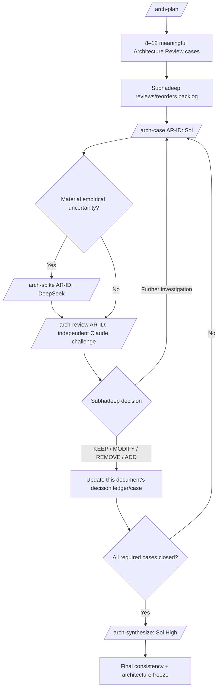

# SubhForge v0.2.0 — Architecture Review

---


---

> **Normative-home rule:** every rule has exactly one normative home. Other documents reference it; they do not restate it.
>
> - `V0.2-ARCHITECTURE.md` — structural architecture, authority boundaries, agents, traceability architecture, skills/MCP/context/non-goals.
> - `V0.2-WORKFLOW-CONTRACTS.md` — lifecycle semantics, readiness, verification, escalation, reconciliation, status/resume and project-version upgrade behavior.
> - `V0.2-ARCHITECTURE-REVIEW.md` — AR questions, options, POCs, evidence, decision record and cross-reference ledger.
> - `V0.2-QUALIFICATION.md` — validation strategy, fixtures, scenarios, dogfood and release evidence.
> - `SUBHFORGE-DELIVERY-TIMELINE.md` — dates, milestones and schedule checkpoints only.

---


---

> **Purpose:** This is the working evidence/decision document for the Architecture Fitness Review. During review, AR cases are worked here: options, POCs, evidence, independent challenge and decision. When an AR closes, its normative result is written into the owning Architecture or Workflow document; this file retains the reasoning/evidence and points to that normative home.

---


---

> The review document is therefore evidence/history, not a competing architecture authority.

---


---

## 18. Architecture Fitness Review Workflow

The review itself remains deliberate but lightweight.



Review rules:

- approximately **8–12** meaningful cases, not dozens of checklist items;
- approximately **4–5** highest-value spikes only when reasoning/evidence is
  insufficient;
- one normal working session per spike by default;
- spike code stays under `poc/architecture-review/<AR-ID>/`;
- spikes do not modify production SubhForge code;
- independent review uses another strong model family where practical;
- **Subhadeep decides**;
- accepted decisions are updated in this single plan, not another tracker.

---

---

## 26. Review Entry and Exit

### Entry

Architecture review starts after:

- `stable_v0.1.1` is delivered/accepted;
- planned v0.1.x hardening is closed or explicitly dispositioned;
- current implementation evidence/failure lessons are available.

### Review authority

This document is the baseline to challenge.

Accepted directions are not sacred, but they may change only through an
explicit recorded decision with evidence.

### Exit

Review closes only when:

- all blocking Architecture Review cases are settled;
- required spikes produced enough evidence;
- accepted decisions are coherent together;
- work-graph backend/tool/skill/harness boundaries are validated;
- RC exit criteria are frozen;
- this document is updated to the final accepted v0.2 architecture;
- Subhadeep accepts the synthesis.

---

---

## 27. Initial Architecture Review Backlog

The first `/arch-plan` may refine/group these, but it should not silently omit
them.

| AR | Question | Initial risk | Expected evidence |
|---|---|---:|---|
| **AR-01** | Which operational work-graph backend best fits SubhForge: Jira or GitHub Issues, while preserving Git Product Truth and one non-duplicated live operational authority? | CRITICAL | One-session-per-backend POC: hierarchy, dependencies, traceability, PR linkage, human UX, recovery/export, plus tokens/tool calls/latency for next-work and status queries |
| **AR-02** | Are logical agent responsibilities/question authorities correctly separated without excessive ceremony? | HIGH | Workflow analysis + dogfood scenario |
| **AR-03** | Can truthful DAG dependencies plus stable PRD traceability IDs drive bounded impact discovery, cross-Epic/Feature work planning and deterministic status efficiently? | HIGH | Graph/status/traceability prototype + realistic work graph |
| **AR-04** | Can Protected Architecture Invariants be paired with an enforceable deterministic/semantic enforcement matrix without costly duplicate validation machinery? | HIGH | Invariant-check prototype + reconciliation/adversarial scenario |
| **AR-05** | Can durable work-item-ID resume + bounded context reliably reconstruct required authority after long gaps? | CRITICAL | Context/resume spike with multiple Epics/Features/Specs |
| **AR-06** | Are reconciliation's analyse → approve → apply boundaries crash-safe and operationally simple on the selected work backend, including scope holds and overlap? | CRITICAL | Partial multi-item mutation/recovery spike + overlap cases + mandatory 11-scenario reconciliation qualification set |
| **AR-07** | Are Skills and MCP/tool admission/routing strong enough to improve engineering quality without adding security/context sprawl? | HIGH | Capability review + admission-gate cases |
| **AR-08** | Are Feature/Epic verification, invariant enforcement, escaped-defect feedback, evidence freshness and human acceptance sufficient without excessive test cost? | HIGH | MediBot verification dogfood |
| **AR-09** | Are model/harness boundaries portable enough while remaining intentionally non-generic? | MEDIUM | Contract review + behavioral canary |
| **AR-10** | Does intelligent smoke/test layering provide adequate confidence within runtime/token budgets? | HIGH | optimized FAST/FULL evidence |
| **AR-11** | Are observability/diagnostics/recovery sufficient to keep Subhadeep out of SubhForge internals? | HIGH | injected failure cases |
| **AR-12** | Does the consolidated design remain compatible with STANDARD/v0.1 behavior where required? | HIGH | regression suite |

---

---

## 28. Architecture Decision Method

For each AR record inside this document:

1. Requirement/problem.
2. Invariant being protected.
3. Credible failure mode.
4. Relevant established practice / external implementation.
5. Current SubhForge direction.
6. Options/trade-offs.
7. Evidence/spike result.
8. Complexity/cost.
9. Independent challenge.
10. Proposed decision: `KEEP | MODIFY | REMOVE | ADD | FURTHER_INVESTIGATION`.
11. Subhadeep decision.
12. Validation required.
13. Impact on the rest of the architecture.

Every `ADD` must name:

- the failure/invariant it addresses;
- the test/dogfood scenario that would remain materially unsafe without it.

---

---

## 29. Architecture Review Model Routing

| Review operation | Default |
|---|---|
| `/arch-plan` | GPT-5.6 Sol High |
| LOW/MEDIUM `/arch-case` | Sol Medium |
| HIGH/CRITICAL `/arch-case` | Sol High |
| `/arch-spike` | DeepSeek; Sol escalation if bounded experiment cannot complete reliably |
| LOW/MEDIUM independent `/arch-review` | Claude Sonnet via Claude Code + Pro handoff |
| HIGH/CRITICAL independent `/arch-review` | Claude Opus via same handoff |
| `/arch-synthesize` | Sol High |

The Claude handoff remains:

- bounded;
- read-only by default;
- structured result;
- evidence, not authority;
- no automatic Anthropic API spend;
- GPT fallback only when explicitly acceptable.

---

---

## 29A. v0.2 Implementation Sequence — ACCEPTED

Reconciliation must be implemented/tested against the real verification and evidence state model, not a half-defined placeholder.

Preferred implementation order:

```text
Authority planes + selected work-backend foundation
        ↓
Stable FR/NFR identity + traceability
        ↓
Planning / decomposition / truthful DAG
        ↓
Status + resume + work-plan projection
        ↓
Spec implement / verify / review
        ↓
Feature verification + human acceptance
        ↓
Epic verification + human acceptance
        ↓
Reconciliation
        ↓
Intelligent smoke + dogfood qualification
```

Therefore Feature/Epic verification semantics, evidence freshness and completion states are built before reconciliation qualification.

Reconciliation may be designed in parallel, but it does not pass its architecture/release gate until it operates against the actual implemented verification/evidence states.

Schedule gates are owned only by `SUBHFORGE-DELIVERY-TIMELINE.md`; qualification evidence referenced by those gates is owned by `V0.2-QUALIFICATION.md`.

---

## 35. Decision Cross-Reference Ledger

This ledger is an index, not a second statement of the rules. A decision's normative wording lives only at the referenced home.

| Decision area | Status | Normative home |
|---|---|---|
| Vision / personal-workflow principles | ACCEPTED | `V0.2-ARCHITECTURE.md` §§1–3 |
| Product Truth / Operational Work Graph / Execution planes | ACCEPTED | `V0.2-ARCHITECTURE.md` §4 |
| Operational backend selection (Jira vs GitHub Issues) | REVIEW | AR-01 in this document; final architecture result updates `V0.2-ARCHITECTURE.md` §4/§6 |
| Protected Architecture Invariants + enforcement | ACCEPTED | `V0.2-ARCHITECTURE.md` §5 |
| Harness/model/tool boundaries | ACCEPTED | `V0.2-ARCHITECTURE.md` §§6–8 |
| Logical agent responsibilities / authority / grill direction | ACCEPTED | `V0.2-ARCHITECTURE.md` §8 |
| Stable FR/NFR identity and traceability architecture | ACCEPTED | `V0.2-ARCHITECTURE.md` §10.1 |
| Escalation model | ACCEPTED | `V0.2-WORKFLOW-CONTRACTS.md` §8.3 |
| Normal LARGE workflow + planning/grooming | ACCEPTED | `V0.2-WORKFLOW-CONTRACTS.md` §§9–10 |
| DAG work-plan behavior | ACCEPTED | `V0.2-WORKFLOW-CONTRACTS.md` §11 |
| Spec/Feature/Epic/Bug delivery lifecycle | ACCEPTED | `V0.2-WORKFLOW-CONTRACTS.md` §§12–15 |
| Reconciliation, scope holds, pause/resume, APPLY, overlap | ACCEPTED | `V0.2-WORKFLOW-CONTRACTS.md` §16 |
| Change triage / fast lane / status / durable resume | ACCEPTED | `V0.2-WORKFLOW-CONTRACTS.md` §17 |
| Verification levels/evidence semantics | ACCEPTED | `V0.2-WORKFLOW-CONTRACTS.md` §23 |
| Skills/MCP/context/cost boundaries | ACCEPTED | `V0.2-ARCHITECTURE.md` §§19–22 |
| Validation/smoke economics | ACCEPTED | `V0.2-QUALIFICATION.md` §24 |
| Reconciliation shared fixture + 11 scenarios | ACCEPTED qualification contract | `V0.2-QUALIFICATION.md` §30.2 |
| Adversarial qualification | ACCEPTED qualification contract | `V0.2-QUALIFICATION.md` §30.4 |
| RC1/RC2/RC3/stable evidence | ACCEPTED qualification contract | `V0.2-QUALIFICATION.md` §31 |
| VidyaBeacon SubhForge version pin/upgrade | ACCEPTED | `V0.2-WORKFLOW-CONTRACTS.md` §31A |
| Delivery dates/checkpoints | ACCEPTED schedule | `SUBHFORGE-DELIVERY-TIMELINE.md` |

---

## 36. Superseded Decisions

The following older design directions are intentionally **not carried forward**:

- Markdown/Git as the operational Epic/Feature/Spec store for LARGE projects;
- a repository file tree containing every Epic/Feature/Spec;
- SQLite as a planned workflow-state store;
- linked-list/sequential dependency modelling;
- requirement that an entire Epic finish before another Epic can progress;
- separate V2 discovery/PRD/architecture files for normal evolution;
- a heavyweight Status Agent;
- allowing Planner to resolve upstream product/architecture ambiguity by asking
  new requirement questions;
- treating Kilo, one model provider or a work-management backend's raw schema as core SubhForge
  semantics;
- treating Jira as selected before evidence;
- "zero bugs at Epic verification" as a hard lifecycle invariant.

---

---

## 37. Questions the Architecture Fitness Review Must Close

1. Which backend wins the representative POC: Jira or GitHub Issues?
2. What exact hierarchy/fields/links/labels/structured metadata are required on the selected backend—no more?
3. How is the reconciliation scope hold (`RECONCILING_BY: REC-*`) physically represented and queried in the selected backend?
4. How are overlapping/open reconciliation packages represented so duplicate, compatible and conflicting effective scopes are detected deterministically?
5. What is the minimal work-management capability interface exposed to agents?
6. How is Git ↔ operational-work-backend drift detected without creating a second truth store?
7. How are stable PRD requirement IDs physically represented, and how are traces stored/queryable in the selected backend?
8. How are verification evidence references represented across the two planes?
9. What deterministic graph/status/traceability helper is required after the backend is selected?
10. What exact invariant-enforcement representation does the Architect produce, and how does `/verify` discover/run applicable deterministic checks?
11. What are the exact physical Kilo agents/commands for the logical roles in §8?
12. Which additional engineering capability gaps truly deserve new global skills?
13. Which MCP integrations earn baseline scope versus project-specific scope?
14. What exact Protected Architecture Invariant representation is simplest?
15. What minimum observability is needed for backend mutations, agent handoffs, escaped-defect feedback and recovery?
16. Can the architecture stay within the smoke/runtime/context budgets?
17. What migration, if any, is required for existing STANDARD/brownfield projects?
18. Are any remaining v0.1 command/result contracts worth preserving versus simplifying under the selected work-graph model?
19. What exact `/shouldreconcile` triage result vocabulary best expresses DEFECT, LOCAL_REFINEMENT, AUTHORITY_CHANGE and PROTECTED_ARCHITECTURE_CONFLICT without creating unnecessary commands?

Until these are closed, v0.2 architecture is **review-ready, not
implementation-frozen**.

---