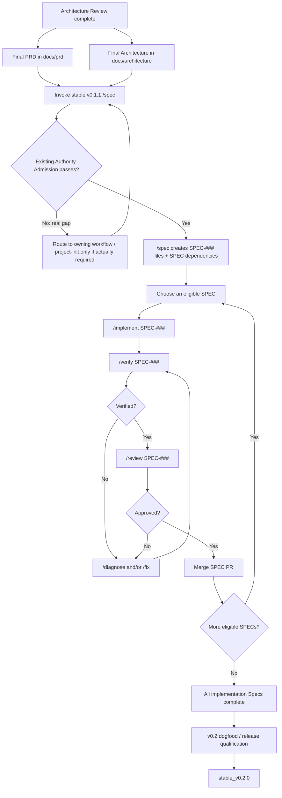

# SubhForge v0.2.0 — Implementation Handoff

> This document explains how the frozen v0.2 design is handed to **stable v0.1.1**
> for implementation.
>
> It introduces **no new implementation framework, IMP layer, helper, or
> orchestration command**.

## 1. Architecture Review Deliverables

Architecture Review is not complete until it leaves two implementation-ready
artifacts in Git:

```text
docs/
├── prd/
│   └── SUBHFORGE-V0.2-PRD.md
└── architecture/
    └── SUBHFORGE-V0.2-ARCHITECTURE.md
```

### PRD

`docs/prd/SUBHFORGE-V0.2-PRD.md`

This is the approved v0.2 product-requirement authority consumed by v0.1.1
`/spec`.

It must contain the final accepted requirements, scope, non-goals, acceptance
intent and stable requirement identities needed for implementation.

### Architecture

`docs/architecture/SUBHFORGE-V0.2-ARCHITECTURE.md`

This is the implementation-facing architecture entry point consumed by v0.1.1
`/spec`.

It must:

- identify the frozen architecture commit;
- reference the authoritative frozen v0.2 architecture/workflow documents;
- expose the approved technology baseline and Protected Architecture Invariants
  required for implementation;
- reference relevant ADRs where applicable;
- contain no new design decision that was not accepted through Architecture
  Review.

It is an implementation handoff, not a second independently editable source of
architecture truth.

---

## 2. v0.1.1 Capability Required

The only v0.1.1 feature required for this handoff is:

> **Existing Authority Admission**

Meaning:

> When valid upstream authority already exists, a downstream workflow validates
> and consumes it directly instead of forcing Subhadeep to replay earlier
> authoring workflows.

For this v0.2 implementation, invoking `/spec` with the final PRD and
Architecture must **not** require replaying:

```text
/prd
/architect
```

or require historical proof that those commands authored the documents.

### What `/spec` still validates

Skipping authoring ceremony does **not** skip correctness checks.

Before admitting the supplied PRD + Architecture, v0.1.1 `/spec` validates:

- both artifacts exist in their canonical Git locations;
- they are complete enough for specification;
- there is no material contradiction between them;
- the technology baseline needed by implementation is established;
- the repository has the project instructions/baseline required to implement
  safely;
- no missing authority would force the Planner to invent product or architecture
  intent.

Current v0.1.0 hard-requires prior `ARCHITECTURE_READY` and
`PROJECT_INIT_READY` workflow results. v0.1.1 must replace that historical
ceremony requirement with **state/authority validation**.

If repository initialization is genuinely incomplete, `/spec` may still block
and route to `/project-init`. It must not require `/project-init` merely to
re-prove already-valid repository state.

---

## 3. Implementation Flow



---

## 4. Who Owns What

| Responsibility | Owner |
|---|---|
| Final PRD + Architecture handoff artifacts | Architecture Review `/arch-synthesize` |
| Admit existing PRD/Architecture without replaying authoring stages | v0.1.1 `/spec` — Existing Authority Admission |
| Decompose implementation into Specs | v0.1.1 `/spec` |
| Determine Spec dependencies / parallelism | v0.1.1 `/spec` |
| Choose an eligible Spec to work next | Subhadeep, using the dependency information written by `/spec` |
| Implement | v0.1.1 `/implement` |
| Verify | v0.1.1 `/verify` |
| Diagnose/fix failures | v0.1.1 `/diagnose` / `/fix` |
| Review | v0.1.1 `/review` |
| Product / architecture / risk decisions | Subhadeep |

> **Spec IDs do not imply execution order. Follow the dependencies declared by
> `/spec`; where several Specs are eligible, any safe eligible Spec may be
> selected.**

---

## 5. What We Are NOT Building

For the v0.2 implementation phase we do **not** add:

- `IMP-###` items;
- an implementation manifest;
- a temporary Python scheduler/helper;
- `/impl-*` commands;
- a second Planner/Builder/Verifier/Reviewer stack;
- another lifecycle or work graph.

Stable v0.1.1 is the implementation workflow.

---

## 6. One-Line Operating Procedure

After Architecture Review freezes v0.2:

```text
final PRD + final Architecture
→ /spec
→ implement eligible Specs one by one
→ /verify
→ /review
→ merge
→ repeat
→ dogfood / qualify
→ stable_v0.2.0
```
