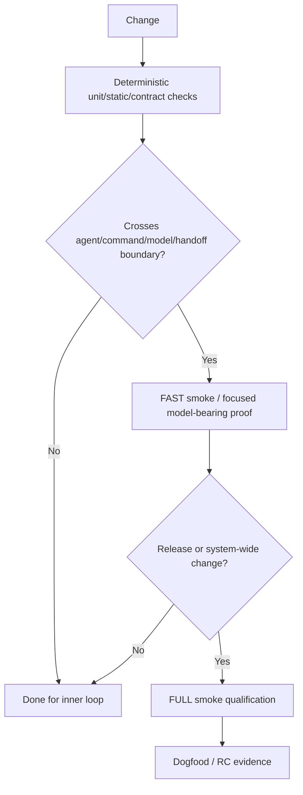

# SubhForge v0.2.0 — Qualification

---

---

> **Normative-home rule:** every rule has exactly one normative home. Other documents reference it; they do not restate it.
>
> - `V0.2-ARCHITECTURE.md` — structural architecture, authority boundaries, agents, traceability architecture, skills/MCP/context/non-goals.
> - `V0.2-WORKFLOW-CONTRACTS.md` — lifecycle semantics, readiness, verification, escalation, reconciliation, status/resume and project-version upgrade behavior.
> - `V0.2-ARCHITECTURE-REVIEW.md` — AR questions, options, POCs, evidence, decision record and cross-reference ledger.
> - `V0.2-QUALIFICATION.md` — validation strategy, fixtures, scenarios, dogfood and release evidence.
> - `SUBHFORGE-DELIVERY-TIMELINE.md` — dates, milestones and schedule checkpoints only.

---

---

> This document owns how v0.2 is proven: validation layers, fixtures, scenarios, dogfood, adversarial qualification and release evidence. It references Architecture/Workflow rules rather than restating them.

---

---

## 24. Layered Validation Strategy

Framework validation is layered so expensive model-bearing smoke is used only
where it adds confidence.

Rules:

1. deterministic/local proof first;
2. FAST is not a per-edit ritual;
3. FULL is release/system-wide qualification, not normal development;
4. impact determines validation breadth;
5. dry orchestration/contract validation belongs below smoke;
6. FULL comes after cheap gates are green;
7. an early FULL run requires an explicit reason.

### 24.1 Performance budgets retained from hardening

For tiny default fixtures:

- FAST target ≤ **10 min**; investigate > **15 min**;
- FULL target ≤ **25 min**;
- FULL > **30 min** = `PERFORMANCE_BUDGET_EXCEEDED` unless explained by
  provider outage or explicit human wait;
- Claude runtime calls in smoke = **0 by default**;
- avoid repeated unchanged authority reads;
- runtime/workspace setup is deterministic.

### 24.2 FULL execution design

FULL should:

- plan fixture once;
- create a clean checkpoint;
- fan independent scenarios out from disposable checkpoint copies;
- inject failures deterministically;
- assemble exact scenario context packets;
- invoke only the model judgement actually under test;
- reuse valid senior-review evidence unless review-relevant identity changed;
- bound retries;
- capture per-scenario timing/model/token data;
- keep fixture product complexity tiny.

### 24.3 Future targeted fixture candidates retained

These are **DEFERRED**, not default smoke fixtures.

| Fixture | Introduce when | Primary value |
|---|---|---|
| `full-frontend-app` | SubhForge changes frontend/browser/E2E/accessibility workflow | UI/browser/a11y verification |
| `full-event-worker` | SubhForge changes async/retry/idempotency/event guidance | Event/concurrency/recovery behavior |
| `full-cloud-iac` | SubhForge changes cloud/IaC/IAM/deployment verification | Cloud security/cost/recovery behavior |

Admission rule: add a fixture only when an existing fixture cannot meaningfully
validate a real framework capability, and keep runtime/token/external-cost
explicitly bounded.

---

---

## 30. Dogfood Sequence

### 30.1 MediBot — Greenfield LARGE

Prove:

`Discovery → Research → PRD → Architecture → Protected Invariants → selected work-backend
decomposition → Work Plan/Status → Spec implementation → Feature verification +
human acceptance → Epic verification + human acceptance`

Also prove that no parallel Markdown Epic/Feature/Spec hierarchy is required.

---

### 30.2 MediBot + Evaluation Guardrails — Reconciliation

Reconciliation is qualified against the normative rules in `V0.2-WORKFLOW-CONTRACTS.md` §16 and the requirement/traceability architecture in `V0.2-ARCHITECTURE.md` §10.1. The scenarios below identify test intent; they do **not** redefine the workflow rules.

| # | Scenario intent | Normative rule exercised |
|---:|---|---|
| 1 | No-impact authority change | Workflow §16 impact/stopping + Architecture §10.1 traceability |
| 2 | Future work and RETIRED requirement | Workflow §16 dispositions + Architecture §10.1 retirement identity |
| 3 | Completed/verified work affected | Workflow §16 + Workflow §23 evidence freshness |
| 4 | Cross-Feature dependency propagation | Workflow §§11,16 |
| 5 | Cross-cutting NFR change/reclassification | Architecture §10.1 + Workflow §16 |
| 6 | Protected invariant conflict | Architecture §5 + Workflow §16 |
| 7 | Partial APPLY failure / halted verdict | Workflow §16.3–§16.5 |
| 8 | Legitimate LOCAL_REFINEMENT fast lane | Workflow §17.1 |
| 9 | False-small change actually changes authority | Workflow §17.1 + Workflow §16 |
| 10 | Missing traceability | Architecture §10.1 missing-trace rule + Workflow §16 |
| 11 | In-flight Spec authority change | Workflow §16.1–§16.2 |

#### Shared reconciliation fixture — ACCEPTED qualification contract

The shared fixture is qualification-owned test data and is reset/mutated deterministically between scenarios. It contains:

- multiple Epics and Features;
- one COMPLETE Spec;
- one IN_PROGRESS Spec with preserved branch/worktree;
- one `PAUSED_FOR_RECONCILE` Spec;
- one incomplete/halted REC with an earlier satisfied operation and later conflict;
- one not-started Spec;
- one Feature VERIFIED but not ACCEPTED;
- one accepted/completed higher-level item;
- one Bug under a Feature;
- cross-Feature and cross-Epic dependency edges;
- active FR traces plus one RETIRED FR;
- one SCOPED NFR and one CROSS_CUTTING NFR tied to architecture/enforcement;
- at least one Protected Architecture Invariant;
- independent branches sufficient to prove propagation stopping.

#### Scenario harness assertions

Each scenario records its starting authority/work graph, expected classification, approved verdict/operation order, expected final state, expected evidence obligations, and expected unaffected scope.

Rather than restating lifecycle rules here, the harness asserts the referenced normative contracts directly, including:

- operation identity/precondition/postcondition semantics from Workflow §16.3;
- scope-hold/halted-verdict semantics from Workflow §16.4;
- overlap semantics from Workflow §16.5;
- final verdict integrity rules from Workflow §16.4;
- traceability semantics from Architecture §10.1;
- evidence freshness from Workflow §23.

Architecture review may refine fixture mechanics but may not silently remove a mandatory scenario class.

---

### 30.3 Autonomous Market Intelligence — Scale / Context

Prove:

- multiple Epics/Features/Specs;
- cross-hierarchy DAG sequencing;
- durable work-item-ID resume;
- bounded context;
- status projection;
- multi-session continuity;
- cost/token behavior.

---

### 30.4 Adversarial qualification catalogue — ACCEPTED

The pre-consolidation adversarial qualification catalogue remains part of the v0.2
release evidence. It was omitted accidentally during consolidation.

Representative deterministic/adversarial injections include:

- malformed or reformatted machine-significant metadata;
- invented/missing dependency or requirement IDs;
- duplicate work-item identity;
- missing governance/invariant reference;
- invalid acceptance-claim ID;
- evidence referencing a stale or retired claim;
- provider/contract changes after dependent work has progressed;
- broken or cyclic graph introduced before/during reconciliation;
- interruption between approved intent and completed backend mutation;
- forbidden authority mutation attempted by Builder/Fixer;
- repeated verify/fix/diagnose failure;
- retry/token budget exhaustion;
- omitted governing context;
- harness/model/tool failure mid-operation;
- corrupted/partial operational state;
- overlap/conflict between reconciliation packages;
- STANDARD regression caused by LARGE workflow changes.

Desired behavior:

> **Detect → contain → explain → repair automatically when mechanically safe →
> escalate when semantic judgement is required.**

Dogfood/release qualification may select the smallest representative subset needed to
cover each required failure class, but required system properties cannot be silently
dropped to preserve schedule.

---

---

## 31. Release Evidence

### RC1 — Architecture implemented

Must show:

- deterministic gates;
- Git / selected operational-work-backend authority boundary;
- work graph mechanics;
- protected-invariant guard;
- work-plan/status projection;
- recovery paths;
- behavioral drift canary;
- STANDARD protection.

### RC2 — Greenfield delivery

MediBot proves meaningful LARGE lifecycle and recovery.

### RC3 — Evolution/reconciliation

Guardrails prove:

- authority evolution;
- invariant enforcement;
- planner verdict;
- human approval;
- safe selected-backend application;
- impact/evidence invalidation;
- implementation + re-verification.

### Stable v0.2.0

Requires:

- larger-scale/context qualification;
- STANDARD + LARGE regression;
- install/bootstrap/doctor/release checks;
- required adversarial cases;
- acceptable runtime/token behavior;
- sufficient diagnostics/recovery;
- final release bar accepted by Subhadeep.

Dogfood evidence is not removed merely to preserve schedule.

---

---

## 32. SubhForge Intervention Tally

The most meaningful operational metric is:

> **How often does SubhForge force Subhadeep to understand or repair SubhForge
> internals while trying to build a product?**

For meaningful dogfood interruptions record:

- operation/project;
- failure category;
- whether diagnosis was correct;
- automatic/guided/manual recovery;
- approximate human intervention.

Also count recurring cases where Subhadeep must manually:

- reconstruct project status;
- choose work that the graph could derive;
- reload broad history just to give an agent context.

Repeated occurrences are architecture evidence.

For VidyaBeacon this should approach zero.

---