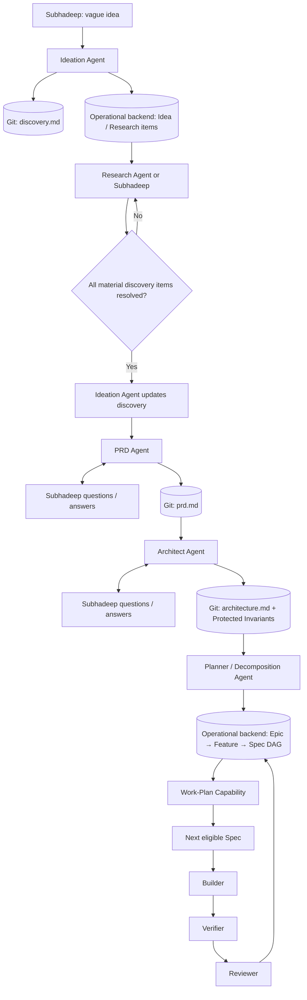
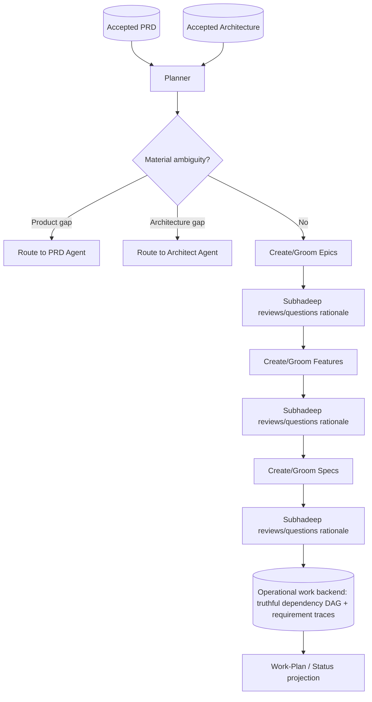
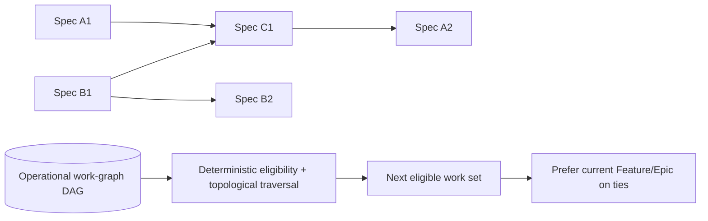
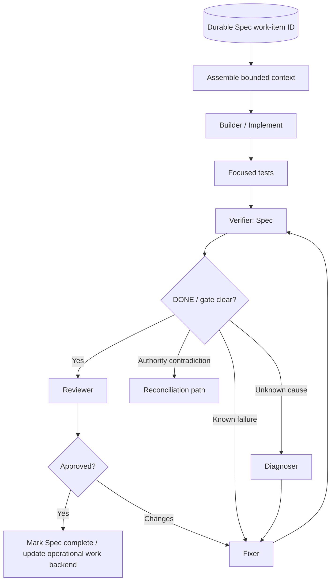
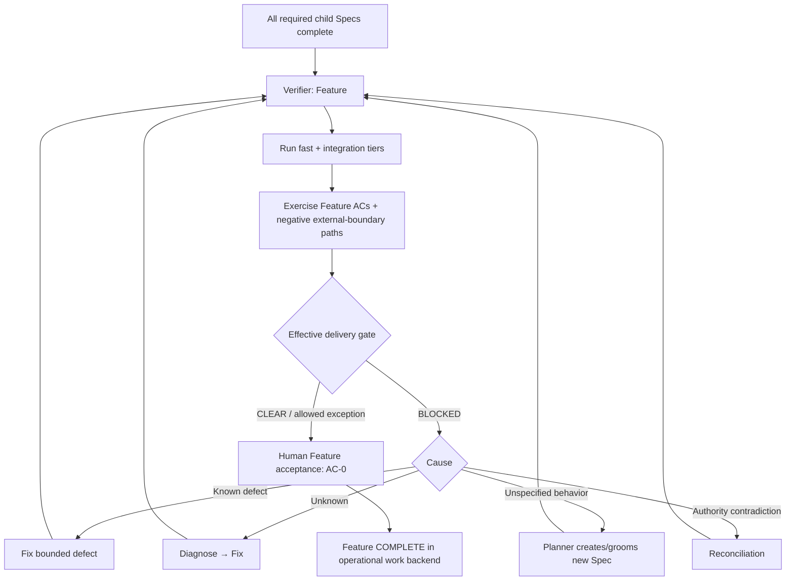
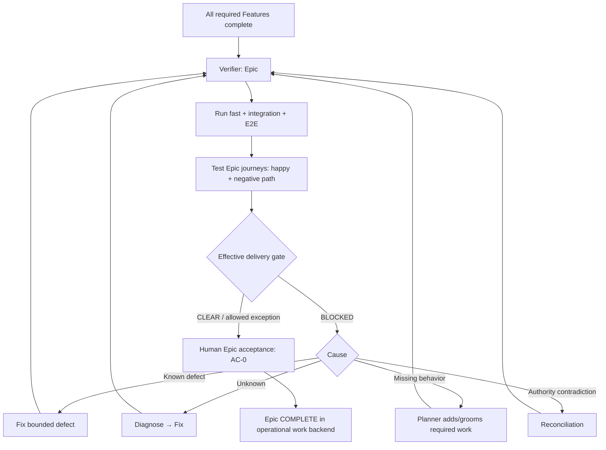
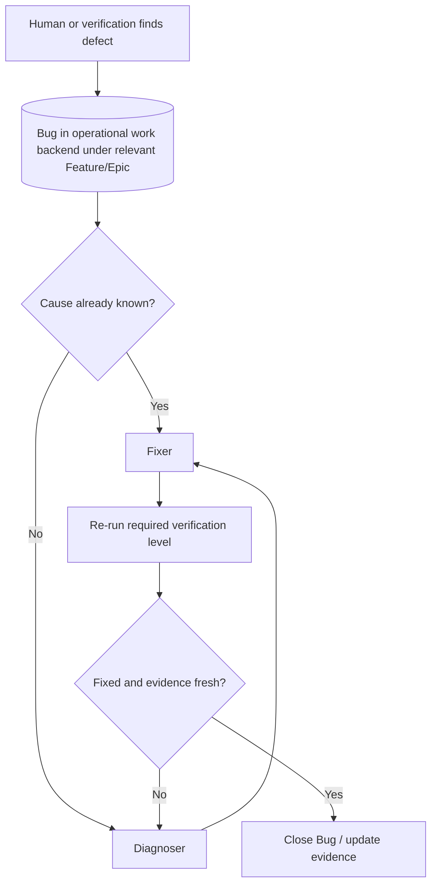
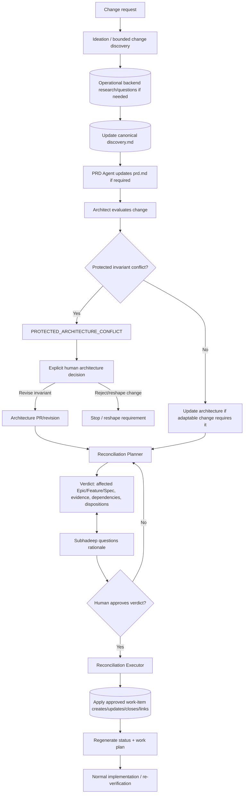
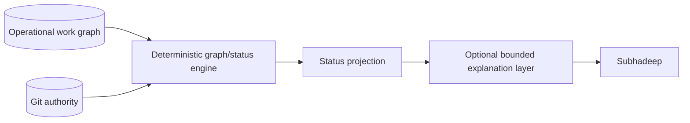

# SubhForge v0.2.0 — Workflow Contracts

> Document authority and stable-section policy: see `design/README.md`.


---


---

> This document is the normative home for lifecycle/workflow semantics. Structural architecture is in `V0.2-ARCHITECTURE.md`; qualification cases must reference these contracts instead of restating them.

---


---

## 8.3 Escalation Model

---

The escalation model is **ACCEPTED**.

The pre-consolidation escalation model remains valid and was omitted accidentally;
it is carried forward here in backend-neutral form.

Escalation ladder:

```text
LOCAL_IMPLEMENTATION_CHOICE
    → agent may decide

SPECIFICATION_CLARIFICATION_REQUIRED
    → accepted behavior is insufficiently clear

ARCHITECTURE_ESCALATION_REQUIRED
    → durable system-level constraint / boundary / pattern is unclear or must change

HUMAN_DECISION_REQUIRED
    → Subhadeep's priorities, risk, cost, lock-in, scope or reserved decision is required
```

Classification rules:

- a local implementation choice must not change accepted behavior, acceptance, external
  contracts, project policy or architecture, and must be safely reversible without
  migration/coordination;
- tests may verify accepted behavior but may not invent the expected behavior;
- material behavioral ambiguity routes to specification clarification;
- establishing/changing/reinterpreting durable system-level constraints routes to
  architecture escalation;
- decisions depending on Subhadeep's priorities/trade-offs route to
  `HUMAN_DECISION_REQUIRED`;
- classify conservatively when autonomy requires material argument about unstated intent.

Blocking is a **property, not an escalation category**. The test is:

> Would the affected work remain correct under every reasonable resolution?

If not, pause only the narrowest dependent scope. Independent safe work continues.

Every durable escalation record must identify:

- classification and origin;
- unresolved decision and governing authority consulted;
- why escalation is required;
- options/interpretations and technical assessment;
- blocking assessment and blocked work;
- safe continuation, or `None` with reason;
- required owner/resolution.

The final answer is promoted into the canonical authority that semantically owns it.
The escalation record keeps provenance only and is not itself product/architecture truth.

---

## 9. Normal Greenfield LARGE Workflow



Key rules:

- no PRD while material discovery questions remain;
- no decomposition before accepted PRD + architecture;
- Planner does not invent missing requirements;
- implementation starts from an implementation-ready Spec;
- the selected operational work backend is updated after accepted lifecycle transitions.

---

## 10. Planning / Decomposition Workflow

---


---

> Requirement identity and traceability are defined in `V0.2-ARCHITECTURE.md` §10.1.

---


---

### 10.2 Planning / Decomposition Flow



Decomposition intent:

- **Epic:** manageable, human-verifiable end-to-end outcome.
- **Feature:** human-verifiable capability within an Epic.
- **Spec:** smallest implementation-ready behavioral slice an agent can implement end to end.

A rough **5–8 Epics** is a useful heuristic for projects at our expected scale,
not a hard quota.

---

### 10.3 Grooming / readiness gates — ACCEPTED

The pre-consolidation readiness principle remains valid:

> **A work item is ready when the next stage can proceed without inventing material intent.**

Common gate rules for Epic, Feature and Spec:

- governing PRD/architecture authority is accepted and current;
- relevant FR/NFR traces are present and valid;
- dependencies/contracts required by the next stage are consumable or have a named
  tracked owner; an undecided required contract blocks readiness;
- no blocking dependency cycle exists;
- no blocking escalation, blocker, reconciliation hold or incomplete/halted REC affects
  the item;
- non-blocking open questions have an owner and are explicitly safe to defer;
- parent/ancestor authority is in a compatible state;
- material upstream drift has been reconciled before readiness is claimed.

Level-specific gates:

**Epic → READY_FOR_FEATURE_DECOMPOSITION**

- human-evaluable end-to-end outcome and observable surface;
- scope boundaries and non-goals;
- traced functional requirements plus applicable cross-cutting NFR/architecture policy;
- acceptance intent, including human acceptance `AC-0`;
- verification intent including representative happy + negative E2E journeys;
- foundation/enabler prerequisites identified.

**Feature → READY_FOR_SPEC**

- human-evaluable capability and observable surface;
- scope, integration/contract boundaries and non-goals;
- stable acceptance criteria with human capability `AC-0`;
- integration verification intent and E2E where required;
- contracts provided/consumed are explicit;
- candidate implementation slices are coherent enough to decompose without inventing intent.

**Spec → READY_FOR_IMPLEMENTATION**

- bounded implementation-ready behavior;
- every acceptance criterion has a stable `AC-*` identity and is objectively verifiable;
- testing requirements cover relevant seams plus negative/boundary behavior;
- TDD applicability and verification requirements are explicit;
- provided/consumed contracts are explicit;
- expected context fits the 5–15k Spec target or `SPEC_CONTEXT_PRESSURE` is recorded;
- no open material behavioral ambiguity remains.

Questioning discipline:

1. ask only about a gate item unresolved by authority/repository evidence;
2. research external facts before asking Subhadeep for a decision;
3. batch related questions into one bounded decision frontier;
4. stop asking as soon as the gate passes;
5. never re-ask a persisted answer.

---

## 11. Work-Plan and DAG Workflow

Dependencies are a **DAG**, not a linked list.



Rules:

- dependency edges represent real prerequisites only;
- work may cross Epic/Feature boundaries;
- starting one Epic does not require finishing it before another Epic;
- when several items are equally eligible, prefer continuity to reduce context
  switching;
- never invent an edge simply to create a convenient sequence;
- a Spec in `PAUSED_FOR_RECONCILE` is **not eligible work**;
- any downstream item whose real prerequisite chain passes through that paused
  Spec is derived as temporarily ineligible;
- independent eligible work remains available, so one reconciliation pause does
  **not** freeze the whole project;
- dependent items do not themselves enter `PAUSED_FOR_RECONCILE`; their
  ineligibility is derived from the DAG rather than persisted as duplicate state;
- any work item inside the candidate/touched scope of an **analysing, awaiting-approval,
  applying, incomplete or halted REC** is ineligible for normal work-plan selection;
- if such a held item is an `IN_PROGRESS` Spec, it is additionally persisted as
  `PAUSED_FOR_RECONCILE` to protect its open implementation branch/worktree;
- downstream items depending on that reconciling scope are derived as temporarily
  ineligible, while unrelated work remains available.

---

## 12. Spec Delivery Workflow



The normal product loop is intentionally smaller than framework smoke.

---

## 13. Feature Verification Workflow

Feature completion is not inferred from "all Specs done".



Feature verification proves integrated capability across child Specs.

Human acceptance proves the **human-evaluable capability**, which automation
cannot substitute.

---

## 14. Epic Verification Workflow



Epic verification should be strong enough that human Epic acceptance is not the
first place normal integration defects are discovered.

---

### 14.1 Escaped-defect feedback — ACCEPTED

"Zero bugs at Epic verification" is a **quality goal, not a workflow invariant**.

If Feature/Epic verification or human acceptance finds a defect, SubhForge records the Bug normally and also classifies where the defect should reasonably have been caught:

- missing/weak Spec acceptance criterion;
- missing Spec-level test;
- missing Feature integration coverage;
- missing Epic E2E journey;
- incorrect architecture assumption;
- genuinely emergent integration behavior.

This classification feeds future planning/test templates and dogfood evidence. Repeated escapes from the same layer are treated as a verification-design weakness to fix, not as an impossible state.

---

## 15. Bug / Diagnose / Fix Workflow



A Bug references the operational work graph; it does not require a Markdown bug
artifact in the repository.

---

## 16. Reconciliation Workflow

Reconciliation uses:

> **analyse → human approve → apply**



Reconciliation dispositions may include:

- retain;
- repurpose when work has not started and authority remains truthful;
- supersede/close;
- create new work;
- require re-verification;
- update dependency relationships.

### 16.1 In-flight Spec affected by reconciliation — ACCEPTED

If a requirement/authority change affects a Spec that is already **IN_PROGRESS** with
an open branch or working tree, the backend persists the Spec state:

`PAUSED_FOR_RECONCILE`

This is a real lifecycle state, not just explanatory text.

Default transition:

> **IN_PROGRESS → PAUSED_FOR_RECONCILE → RECONCILE → RESUME / ADAPT / SUPERSEDE**

Rules:

- stop further implementation once the affected relationship is established;
- when reconciliation analysis places an `IN_PROGRESS` Spec inside the candidate scope,
  the deterministic reconciliation-control layer persists `PAUSED_FOR_RECONCILE` as part
  of acquiring that REC's hold, before returning control;
- preserve the branch/working tree exactly as work-in-progress; do not delete it;
- `/implement` and every resume path must check the persisted Spec state before
  touching the branch/worktree;
- if the state is `PAUSED_FOR_RECONCILE`, implementation fails closed and routes
  to the open reconciliation package;
- do not let the Spec finish or generate new "fresh" verification evidence
  against stale authority;
- run reconciliation against the current persisted work-item state plus the
  preserved implementation state;
- the approved reconciliation verdict chooses one of:
  - **RESUME_UNCHANGED** — current implementation remains semantically truthful;
  - **ADAPT / REPURPOSE** — preserve useful implementation and change only what
    the new authority requires;
  - **SUPERSEDE** — current Spec/work is no longer authoritative; preserve history,
    stop delivery, and create/route replacement work as required;
- branch/worktree cleanup occurs only after the accepted disposition makes
  cleanup safe.

### 16.2 Baseline refresh after a pause — ACCEPTED

A paused branch may drift behind the current integration branch while reconciliation
is being resolved. Therefore `RESUME_UNCHANGED` and `ADAPT / REPURPOSE` do not
immediately restore the Spec to `IN_PROGRESS`.

First perform **REFRESH_IMPLEMENTATION_BASELINE**:

1. refresh the paused branch/worktree against the current integration baseline;
2. for the normal private solo-development Git workflow, **rebase is the default
   implementation**, but the architecture contract is baseline refresh rather
   than a hard dependency on one Git strategy;
3. resolve baseline conflicts/drift;
4. rerun the tests/evidence specifically affected by the reconciliation and
   baseline refresh;
5. only when those checks pass may the Spec return to `IN_PROGRESS`.

If baseline refresh or required tests fail, the Spec remains
`PAUSED_FOR_RECONCILE` and the failure is diagnosed rather than silently resumed.

This default minimizes wasted work without allowing stale-authority or stale-baseline
implementation to continue.

### 16.3 Idempotent reconciliation APPLY operations — ACCEPTED

Every approved mutating reconciliation operation receives a stable operation key:

`<REC-ID>/op-<SEQ>`

Example: `REC-0042/op-07`.

#### Intent versus actual state

The **approved reconciliation verdict** is the durable authority for intended operations.
It records the stable operation ID plus enough information to prove the intended change, including:

- operation type;
- target;
- required safe precondition where applicable;
- expected postcondition / resulting backend state.

The verdict is **not rewritten or committed after every APPLY operation**.

The **selected operational backend is the authority for actual work-graph state**.

An `APPLIED` marker may exist as transient execution telemetry/cache for diagnostics,
but it is never authoritative and recovery must not depend on it.

#### Retry / recovery algorithm

On first execution or retry, SubhForge derives operation satisfaction from the
backend's actual state:

```text
REC-0042/op-07
      ↓
evaluate expected postcondition against authoritative backend
      ↓
postcondition already true?
  YES → operation already satisfied → skip mutation safely
  NO  → evaluate safe precondition
             ↓
         precondition valid?
           YES → apply mutation
                  ↓
                verify postcondition
                  ↓
                continue
           NO  → RECONCILIATION_INTEGRITY_CONFLICT
                  ↓
                stop and diagnose
```

This correctly handles the crash window:

```text
backend mutation succeeds
        ↓
process crashes before any local/APPLIED marker is written
        ↓
retry reads verdict + authoritative backend
        ↓
postcondition already true
        ↓
skip safely
```

Important rules:

- operation identity is stable across retries;
- a retry never allocates a new operation ID for the same approved mutation;
- **operations are evaluated strictly in the order listed by the approved verdict**;
  later operation preconditions may intentionally depend on state established by
  earlier operations;
- **backend state, not an APPLIED marker, proves whether an operation is satisfied**;
- a marker may accelerate diagnostics but can never override contradictory backend state;
- safe preconditions prevent replaying an old approved mutation against a backend
  whose relevant state has since changed;
- each operation's expected postcondition proves only that **that operation** is
  satisfied; it does not prove that the whole work graph is yet globally valid;
- if neither the intended operation postcondition nor safe precondition matches reality,
  fail closed with `RECONCILIATION_INTEGRITY_CONFLICT`;
- this verdict-intent/backend-state model is the concrete basis for partial-APPLY
  crash recovery and idempotency in reconciliation Scenario 7.

Authority summary:

```text
Git / approved reconciliation verdict
    → intended operations + stable operation IDs + pre/postconditions

Operational work backend
    → actual Epic / Feature / Spec / Bug / dependency state

Optional execution telemetry
    → diagnostics only; never authority

Retry/recovery
    → re-derive satisfaction from backend postconditions
```
### 16.4 Verdict-level reconciliation scope and completion gate — ACCEPTED

A multi-operation reconciliation verdict may legitimately pass through an
intermediate graph that is not yet globally valid. Therefore SubhForge distinguishes:

- **per-operation postconditions** — checked after/while recovering each operation;
- **universal verdict postconditions** — checked only after every listed operation
  has been satisfied in order.

Universal verdict postconditions include at minimum:

- dependency graph is acyclic;
- all work-item / requirement / dependency references resolve;
- FR/NFR traceability is internally valid;
- lifecycle/evidence relationships are internally consistent;
- unaffected work remains unchanged **relative to the reconciliation baseline snapshot**;
- every approved operation's expected postcondition is satisfied.

The reconciliation baseline snapshot is a lightweight fingerprint/version capture of the
candidate/touched work-graph fields at analysis start, not a second authority store.
It exists only to distinguish reconciliation-caused mutation from unrelated concurrent
human edits.

If an unrelated item outside the REC scope changes manually while the REC is open, that
does **not** fail the unaffected-work check. If an item inside the candidate scope changes
outside the REC after the snapshot, the relevant operation precondition or overlap/drift
check must detect it and route through recovery/escalation rather than blaming the verdict
for the out-of-band edit.

These are **verdict-completion guarantees**, not guarantees of every intermediate
state during APPLY.

#### Reconciliation scope lock

The scope hold begins **during reconciliation analysis**, not at APPLY.

The Reconciliation Planner computes the candidate affected set, but **does not write the
hold itself**. The deterministic reconciliation-control layer performs the bounded
pre-approval bookkeeping write.

As soon as the candidate affected set is constructed, that layer must durably expose
the candidate scope in the selected operational backend as under reconciliation,
conceptually:

`RECONCILING_BY: REC-0042`

This deterministic hold write is the **only normal pre-approval work-graph mutation**.
It may also transition an affected `IN_PROGRESS` Spec to
`PAUSED_FOR_RECONCILE` and associate it with the REC, because protecting the open
branch requires a persisted lifecycle guard. It may not change planned content,
dependencies, acceptance criteria, completion state or other operational semantics.

This happens before semantic analysis is complete and before human approval, so work
that is about to be superseded cannot be started in the approval window.

The physical representation is backend-specific and will be chosen during the work-graph
backend review, but the semantic contract is fixed:

- the REC identifies its current candidate/touched work-item scope;
- items in that scope are ineligible for ordinary implementation, verification,
  completion or work-plan selection while the REC is analysing, awaiting approval,
  applying or halted;
- downstream work whose true dependency chain relies on a reconciling item is
  derived as temporarily ineligible;
- unrelated eligible work remains available;
- an item proven unaffected during analysis may be released from this REC's hold only
  when no other open REC holds it;
- if analysis/verdict is explicitly cancelled before mutation, remaining scope holds are
  cleared after confirming no operation was applied;
- `/status` exposes the open/halted REC, candidate/touched scope, current phase,
  failing/next operation when known, derived blocked dependents, **hold acquisition time**
  and **current hold age** so forgotten approvals/reconciliations are visible;
- hold age is informational only: there is **no automatic expiry/unlock** because time
  passing does not make stale authority safe.

#### Halted verdict

If an operation encounters `RECONCILIATION_INTEGRITY_CONFLICT`, or if final universal
verdict postconditions fail:

1. stop APPLY immediately;
2. **do not automatically roll back operations already satisfied**;
3. leave the verdict scope marked as reconciling/halted;
4. preserve the approved verdict and actual backend state for diagnosis;
5. exclude touched scope from normal work planning;
6. diagnose the conflict;
7. either complete the existing verdict safely or approve a replacement verdict that
   explicitly supersedes it.

A replacement verdict must reason from the **current backend state**, including
operations already satisfied by the halted verdict. It must not assume the graph was
rolled back to the pre-reconciliation snapshot.

Only after all operations are satisfied **and** universal verdict postconditions pass
may the reconciliation scope lock be cleared and the REC considered complete.

Conceptually:

```text
approved REC verdict
      ↓
mark affected scope RECONCILING
      ↓
op-01 → op-02 → ... → op-N   (strict listed order)
      ↓
all operation postconditions satisfied?
      ↓ yes
run universal verdict postconditions
      ├─ PASS → clear reconciliation scope → REC COMPLETE
      └─ FAIL → keep scope reconciling/halted → diagnose / complete / replace

any op conflict
      ↓
keep already-satisfied ops + keep scope reconciling/halted
      ↓
diagnose / complete existing verdict / approve replacement verdict
```

### 16.5 Overlapping reconciliations — ACCEPTED

The pre-consolidation overlap rule was accidentally omitted. With explicit scope holds,
the v0.2 rule is:

- **disjoint REC scopes may proceed independently**;
- a new reconciliation request with the **same effective delta** as an existing open
  REC resumes/links to that REC rather than creating duplicate operational work;
- compatible obligations affecting the same effective work/claim are merged or
  superseded with provenance to every originating change;
- conflicting effective deltas return `HUMAN_DECISION_REQUIRED`;
- **two different REC packages may never mutate the same effective scope concurrently**.

For a non-identical overlap:

1. detect the existing REC and its held scope;
2. inspect whether any operation from that REC is already satisfied in backend state;
3. if **no operation has been applied/satisfied yet**, the analysis may produce one
   replacement verdict that combines the accepted deltas and explicitly supersedes the
   earlier REC; the scope hold remains continuous;
4. if **any operation is already satisfied, APPLY is in progress, or the REC is halted**,
   return `HUMAN_DECISION_REQUIRED`; either finish the existing verdict or approve a
   replacement verdict derived from the **current backend state**;
5. never replay a stale patch/verdict assumption blindly.

A replacement verdict inherits responsibility for already-changed state; it does not
pretend the project returned to the earlier pre-REC graph.

---

Partial work-graph mutation must be diagnosable, idempotent where practical, and safely recoverable.

---

## 17. Change Triage, Status and Resume Workflow

### 17.1 Guarded change triage / fast lane — ACCEPTED

Not every change should restart `Discovery → PRD → Architecture`, but "small change" is too subjective to be an authority rule.

`/shouldreconcile` therefore acts as the **change-triage gate** and is itself a semantic judgement that must be auditable.

Every triage verdict must explicitly state:

- touched FR IDs, or `none`;
- touched NFR IDs, or `none`;
- touched Protected Architecture Invariants / architecture-quality obligations, or `none`;
- classification;
- reason;
- proposed route.

If the agent cannot cite the relevant FR/NFR/invariant relationships cleanly, it must **not** wave the change through the fast lane. It returns `HUMAN_DECISION_REQUIRED` or routes the missing-trace gap for repair.

Example shape:

```text
Change Triage

Touched FRs: FR-017, FR-024
Touched NFRs: none
Touched Protected Invariants: none

Classification: LOCAL_REFINEMENT
Reason: implementation/testing refinement only; no observable requirement change.
Proposed Route: Planner / Spec fast lane
```

Semantic classes:

- **DEFECT** — implementation violates existing accepted behavior;
- **LOCAL_REFINEMENT** — bounded Spec/planning/test/refactor refinement that stays truthful to accepted PRD + architecture;
- **AUTHORITY_CHANGE** — observable product/accepted authority changes and must enter reconciliation at the correct upstream level;
- **PROTECTED_ARCHITECTURE_CONFLICT** — exceptional human architecture path.

#### Triage approval rule

Triage follows the same general safety pattern:

> **ANALYZE → APPROVE WHEN GOVERNANCE IS BEING REDUCED → APPLY/ROUTE**

Approval is concentrated where a semantic classification could incorrectly bypass normal reconciliation:

- **LOCAL_REFINEMENT** → explicit Subhadeep approval is required before taking the fast lane;
- **DEFECT** → direct Bug/Fix routing is allowed only when the triage verdict cites a
  specific accepted **AC ID** and/or a concrete failing test/evidence item that mechanically
  proves the expected behavior. With no such citation, approval is required for the
  defect-vs-new-requirement judgement;
- **AUTHORITY_CHANGE** → no separate triage approval is required merely to route upward,
  because this is the conservative path. Subhadeep may explicitly **downgrade** the verdict
  to `LOCAL_REFINEMENT`; that human downgrade is itself the required fast-lane approval and
  must be recorded with the reason and cited FR/NFR/invariant context. The agent cannot
  downgrade its own `AUTHORITY_CHANGE`;
- **PROTECTED_ARCHITECTURE_CONFLICT** → no triage approval is required to stop/escalate;
  the later architecture decision is explicitly human-authorized.

The fast lane cannot add new observable product behavior, weaken an accepted requirement, change a Protected Architecture Invariant, or bypass traceability/evidence updates that the refinement actually requires.

It is a triage shortcut for genuinely local work, **not a process bypass**.

### 17.2 Status — ACCEPTED

`/status [PROJECT|EPIC|FEATURE|WORK-ITEM]` is a **capability**, not a heavyweight
autonomous agent.

It should answer:

- completed / active / remaining counts;
- current executable work;
- next eligible item(s);
- blockers;
- open reconciliation obligations;
- Specs in `PAUSED_FOR_RECONCILE`, including their reconciliation package/reason;
- analysing/awaiting-approval/applying/incomplete/halted REC packages and their held scope;
- each hold's acquisition timestamp and current age;
- the failing/next operation when determinable from the verdict + current backend state;
- downstream items temporarily ineligible because they depend on paused or reconciling work;
- why an item is not eligible;
- what prerequisite chain precedes a target;
- approximately how many executable graph items precede a target where that is
  meaningful.

Avoid fake precision such as "63% complete" from raw Spec counts unless a
defensible weighting model exists.



### 17.3 Resume by durable work-item ID — ACCEPTED

There is no generic magic `/continue` that guesses the owner.

Resume means invoking the owning capability against a durable backend work-item target, e.g.:

- implement `SPEC-123`;
- discuss/groom `FEATURE-45`;
- inspect `EPIC-7`;
- resume Bug diagnosis;
- resume an approved reconciliation package.

The durable work-item ID gives SubhForge the bounded work context; SubhForge retrieves
required authority and dependencies itself.

---

## 23. Verification Levels

| Level | Primary evidence |
|---|---|
| **Spec** | Spec ACs; named focused tests + full fast regression tier |
| **Feature** | Feature ACs through observable surface; fast + integration; E2E only where needed |
| **Epic** | Epic journeys; fast + integration + E2E |
| **Human acceptance** | AC-0: human-evaluable Feature capability or Epic outcome |

Testing tiers are defined by execution need:

| Tier | Meaning |
|---|---|
| **fast** | Unit/contract/in-process integration requiring only code |
| **integration** | Real adapters/cross-process composed environment |
| **e2e** | Consumer/user journey through observable surface |

### 23.1 Evidence principles — ACCEPTED

- verification facts are separate from judgement;
- verification reports are immutable evidence;
- evidence freshness must match the implementation identity it claims to prove;
- failed verification cannot be converted into successful evidence;
- reconciliation invalidates only claims whose authority/implementation meaning
  actually changed where claim-level evidence can prove that safely;
- waiver/risk acceptance is explicit and cannot cover human acceptance `AC-0`;
- completed Specs do not casually reopen because higher-level verification found
  an integration defect; fixes are bounded and evidence is refreshed.

---

## 31A. Operational versioning and VidyaBeacon upgrade path — ACCEPTED

VidyaBeacon must not consume an implicitly moving SubhForge.

At VidyaBeacon project start:

- pin the project to an exact tested SubhForge release/tag (initial target:
  `stable_v0.2.0`);
- record that SubhForge version in VidyaBeacon project metadata;
- do not automatically adopt newer SubhForge behavior during active delivery.

After project start, any SubhForge upgrade is an explicit decision.

For a blocking SubhForge fix:

1. fix on the appropriate SubhForge maintenance line;
2. run affected SubhForge deterministic/unit/smoke checks;
3. run the relevant behavioral canary and dogfood/regression slice;
4. verify that the new SubhForge version is **backward-compatible with VidyaBeacon's
   existing operational-backend metadata/fields/labels/state representation**;
5. if compatibility is not preserved, perform and verify an explicit backend-metadata
   migration first;
6. only then update VidyaBeacon's pinned SubhForge version.

Non-blocking convenience/architectural improvements remain on later SubhForge versions
until deliberately adopted. This preserves the operating principle:

> **Build VidyaBeacon using a tested SubhForge release; do not continuously rebuild
> SubhForge underneath VidyaBeacon.**

---