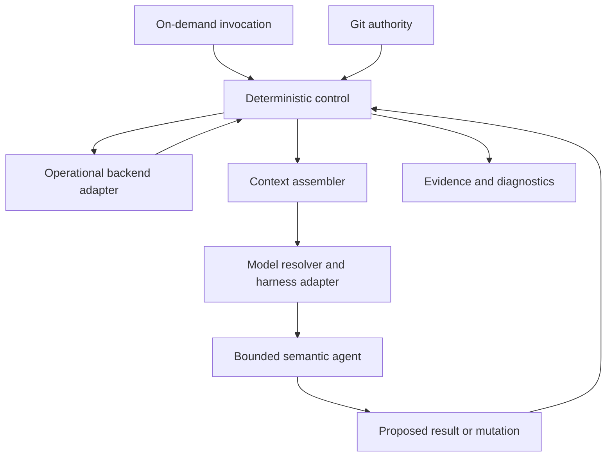

# SubhForge v0.2.0 — Architecture

**Status:** Structural design draft; accepted decisions retained, new model-resolution design under REVIEW
**Date:** 2026-10-06

This document defines the components, authority stores, interfaces, execution paths and enforcement seams that realize the [PRD](../prd/SUBHFORGE-V0.2-PRD.md). It does not redefine product goals, role permissions, lifecycle rules or release success.

- [Discovery](../discovery/SUBHFORGE-V0.2-DISCOVERY.md) owns unresolved physical decisions.
- [Workflow Contracts](../workflow/SUBHFORGE-V0.2-WORKFLOW-CONTRACTS.md) owns transitions, readiness, acceptance, reconciliation and recovery semantics.
- [Qualification](../qualification/SUBHFORGE-V0.2-QUALIFICATION.md) owns proof and release evidence.
- [Timeline](../SUBHFORGE-DELIVERY-TIMELINE.md) owns dates.

Existing referenced section identities are retained where useful. REVIEW sections are design proposals, not implemented capabilities or closed Discovery items.

## 1. Architecture Scope and Requirement Drivers

| PRD driver | Structural response |
|---|---|
| CON-003, CON-010; FR-008 | Git authority and one external operational backend; recoverable exports are not live stores |
| CON-004, CON-009; FR-007, FR-009, FR-016 | Deterministic control for identity, eligibility, transitions and guarded reconciliation |
| CON-005; NFR-005; FR-021 | Provider-neutral agent contracts, central model resolver and narrow harness/backend adapters |
| FR-018; NFR-003, NFR-004 | Versioned context packets, budget preflight and bounded execution |
| FR-005, FR-011, FR-012, FR-013, FR-019 | Invariant enforcement, separate author/verify/review responsibilities and admitted external tools |

Core delivery covers requirement intake through reviewed implementation and higher-level acceptance. Post-PR deployment orchestration is excluded by PRD §1.2. Feedback re-enters through the existing Bug/Change Triage paths, not a new runtime subsystem.

## 2. Decision Status and Document Boundary

The shared status vocabulary lives in `design/README.md`. PRD owns what and why; Architecture owns structural choices and their trade-offs; Workflow owns operational behavior; Qualification owns proof. A draft design cannot silently resolve an open DI.

## 3. Component Structure — ACCEPTED DIRECTION / REVIEW PHYSICAL MAPPING

Use small Python deterministic helpers and bounded semantic agents in the existing local development environment. No background scheduler, standalone workflow service or new database is assumed.



| Component | Input/output boundary | Owns structurally |
|---|---|---|
| Deterministic control | Invocation + current authority/state → admission result, authorized operation or blocker | Gate/state/identity checks, budgets and mutation preconditions |
| Authority reader | Canonical Git references → accepted revision identity and bounded content | Git lookup and freshness references; does not author semantic decisions |
| Backend adapter | Capability requests → complete normalized graph reads or guarded writes | Selected backend transport, pagination, versions and recovery |
| Context assembler | Target + declared relationships → bounded current packet | Required authority/dependencies, evidence and obligations; packet is derived |
| Model resolver | Agent identity + optional model key + config revision → immutable execution selection | Central key/default resolution and compatibility preflight (§7) |
| Harness adapter | Agent contract + context + resolved selection → output/action observations | Provider/harness invocation; no lifecycle authority |
| Semantic agent | Accepted context → domain reasoning, code changes or proposed operations | One responsibility defined by PRD §4.1 |
| Evidence/diagnostics helpers | Check results and operation facts → immutable evidence/references | Freshness inputs and recovery diagnostics, not semantic permission |

These are logical seams, not a requirement for eight services or eight physical agents. DI-008 selects the smallest file/command layout preserving them. Verifier executes checks and Reviewer judges evidence through separate capability invocations; the diagram does not grant agents unrestricted backend access.

### 3.1 Control direction and harness feasibility — REVIEW (`DI-008`)

Proposed by RV-19. The diagram above reads as **control-led**: a deterministic entry point assembles context, resolves the model and calls the harness. Workflow's `/command` references and §§6.4/8.1 read as **harness-led**: Subhadeep invokes an agent inside the harness, and that agent calls deterministic helpers as tools. These are different topologies. Which one is the outer loop decides where FR-021 selection, §6.4 guards, §21 packet injection and §22 budget preflight can actually be enforced, and whether a multi-agent handoff inside one invocation (Workflow §17.4) is possible at all.

DI-008 must choose one primary topology, or name the operations that use each, before other physical mapping depends on it. A harness-led design cannot claim a guard that the invoked agent could skip by not calling the helper. A control-led design depends on the harness offering non-interactive invocation with per-call model and tool scope.

Settle this with a bounded, disposable probe of the current harness rather than by assumption. Minimum probe questions:

- can a model be selected per invocation from outside the agent definition;
- can agent/command definitions be scoped to one project;
- can tools and MCP servers be restricted per agent;
- can the harness be invoked non-interactively with a supplied context packet and return a structured result;
- can one run hand off to a second agent that uses a different model;
- what usage/token facts does it report.

An unsupported answer narrows the design. It is not worked around with a prompt that claims the capability. Probe code is not production code.

## 4. Authority and Execution Planes

### 4.1 Product Truth — Git — ACCEPTED

Git stores canonical Discovery/PRD/Architecture, source/tests, accepted ADRs and approved mutating REC verdicts. Documents evolve in place; Git history provides versions. An approved verdict stores intent, operation identities and pre/postconditions. Actual backend state is not copied into that verdict as a second authority.

The central model map is versioned execution configuration in Git (§7). It controls dispatch, not product or architecture meaning. Credentials remain outside it and outside prompts/evidence.

### 4.2 Operational Work Graph — REVIEW (`DI-003`)

One selected external backend stores Project/Idea/Research/Epic/Feature/Spec/Bug identities, lifecycle and acceptance metadata, declared relationships, traces, implementation/evidence links, ESC/BLK records and REC operational holds/obligations. No second live Markdown work hierarchy is maintained.

DI-003 compares Jira and GitHub Issues using the same representative graph, including next-work/status query cost, hierarchy/contracts, permission boundaries, retry/recovery and export/restore. That evaluation and minimum schema remain Discovery work. A recovery export is a non-live snapshot. When exports are produced, where they are kept and how their age is exposed are not yet defined (RV-27); neither is isolation between several managed projects in one backend (RV-28). Both are DI-003 work. This section lists evidence *links* only: the durable home of evidence bodies, invocation records and human-decision records is DI-005 work (RV-26). If neither candidate is suitable, preserve the two-plane separation and seek an explicit decision rather than introducing another store silently.

### 4.3 Execution Plane — ACCEPTED

The control layer derives status/work-plan views from Git references and the backend. Those views are read-only projections. Semantic agents run through the harness adapter; code/test execution occurs in bounded implementation workspaces. CI/project-specific test tooling supplies check results, not independent product authority.

---

### 4.4 Cross-plane safety boundary — REVIEW (`DI-005`, `DI-006`)

Git and the external work backend do not provide one shared transaction. DI-005/DI-006 must define the smallest safe authority-activation and mutation protocol, including:

- how draft versus accepted authority and the exact approved revision are recognized;
- how an accepted revision invalidates old readiness/evidence before affected work can advance, including the window before REC candidate holds exist;
- version/fingerprint checks at mutation and completion boundaries, rather than trusting a context packet loaded earlier;
- ownership of serialization or equivalent conflict detection for overlapping invocations and manual backend edits;
- the supported concurrency envelope (RV-25): whether more than one mutating invocation may run against a project at once, for example two Specs in separate worktrees, or one at a time with conflict detection reserved for manual edits;
- complete versus partial/paginated/unavailable reads;
- recovery after a successful remote write whose response is lost;
- durable create identity, duplicate detection and safe retry under the selected backend's actual API semantics.

Atomic transition semantics in Workflow §2.4 are a required observable guarantee, not an assumption that several remote writes are transactional. Qualification must prove the chosen protocol against real backend boundaries. No local cache or telemetry marker may override authoritative state.

---

## 5. Protected Architecture Invariant Enforcement

### 5.1 Representation boundary — ACCEPTED SEMANTICS / REVIEW (`DI-007`)

PRD FR-005 defines protection. Architect maps each applicable protected invariant to its accepted authority, implementation scope and enforcement obligation. The smallest durable physical schema remains DI-007 work; it must link human-readable authority to executable/semantic checks without a second fitness-function platform.

### 5.2 Conflict path — ACCEPTED

Control/verification routes an invariant conflict to `PROTECTED_ARCHITECTURE_CONFLICT` before unauthorized downstream mutation. Workflow §17.1 owns the exceptional human revision path. Ordinary planning, fixing and REC execution cannot replace that authority.

### 5.3 Enforcement Matrix — ACCEPTED

| Mode | Structural enforcement path |
|---|---|
| DETERMINISTIC | Declared static/dependency/contract/integration check → Verifier → immutable result |
| SEMANTIC | Bounded accepted invariant + change context → Architect/Reviewer judgement |
| MIXED | Mechanical check evidence + separately assessed semantic remainder |

Verifier is the execution owner of deterministic invariant checks. Project CI may reuse those checks where useful; it is not a mandatory duplicate gate. The matrix links scope and check ownership so an NFR is not treated as universally covered by one unrelated passing test.

### 5.4 Exceptional revision — ACCEPTED

Human-authorized architecture revision changes canonical authority first, with its explicit review/approval record. Normal reconciliation then assesses that newly accepted revision. There is no automatic rebaseline engine.

## 6. Harness, Tool and Mutation Boundaries

### 6.1 Local execution topology — ACCEPTED

VS Code is the current development environment; Kilo is the current replaceable execution harness; Python helpers implement mechanical control. Git/GitHub provide versioned authority and repository integration. The selected operational backend remains external. Claude Code/Pro may be an independently invoked reasoning path, not a mandatory lifecycle dependency. Model defaults are configuration (§7), not agent architecture.

### 6.2 Backend adapter seam — ACCEPTED

Agents receive normalized capabilities: get target/ancestors/declared dependencies, query eligible children, propose create/link/state change, and attach implementation/evidence references. Backend-specific fields and API/MCP calls stay in the selected adapter. v0.2 implements only the operations needed by that backend; it does not implement interchangeable backends merely to prove abstraction.

### 6.3 Harness adapter seam — ACCEPTED

The adapter receives a provider-neutral agent contract, context packet and resolved execution selection. It translates those inputs into the configured harness call, returns structured output/diagnostics and reports unsupported selection explicitly. Changing the harness cannot change work identity, authority or handover meaning. A new transport may require adapter work; an existing supported model-version update is configuration-only.

---

### 6.4 Guarded mutation boundary — REVIEW (`DI-008`)

Agent instructions alone are not enforcement. Agents propose operational mutations through a bounded capability; the deterministic control/adapter layer checks target identity, current accepted authority, invocation permission, lifecycle/dependency/REC guards and relevant version preconditions before committing them. Review and verification remain separate from implementation.

DI-008 must specify which writes are mechanically prevented, which are detected by verification/review, and which remain trusted local actions. In particular, distinguish operational-backend writes, accepted Git-authority changes and ordinary implementation edits. Classify Git remote and history-affecting operations as well: push, force-push after a Workflow §16.2 rebase, branch/worktree deletion and tags (RV-36, proposed). Where practical, remove direct raw write credentials/tools from an agent whose writes must pass the guard. If the chosen harness cannot isolate shell/filesystem access, document that limitation and the containment/detection used; do not claim a sandbox that does not exist.

The boundary must reject invalid proposals even when a model confidently requests them. Approval applies only to its recorded scope/revision and does not disable other guards. This is a narrow control boundary, not a new agent, permission platform or second state store. Its failure-path proof belongs in Qualification §24.11.

---

## 7. Central Model Resolution — REVIEW (`DI-008`)

This design realizes PRD FR-021. Logical agent definitions contain role identity, instructions, input/output contracts and required capabilities; no model-version identifier or duplicated role-to-model table belongs in an agent file.

### 7.1 Single configuration map

One versioned, inspectable map contains:

- `models`: stable selection key → provider, concrete model/version identifier, supported execution binding and relevant capability/context metadata;
- `defaults`: logical agent identity → one of those selection keys.

Secrets are referenced through isolated credential bindings, never embedded. Format/path and exact required fields are DI-008 implementation decisions. The following shape is illustrative, not a selected schema or a real model inventory:

```json
{
  "models": {
    "claude-sonnet": {
      "provider": "anthropic",
      "model_id": "<configured-version-identifier>",
      "execution_binding": "<supported-harness-binding>"
    }
  },
  "defaults": { "architect": "claude-sonnet" }
}
```

Version and role defaults have one home. Changing the version behind `claude-sonnet` changes that map entry only. This does not permit a harness to replace an unavailable configured identifier with its own unrecorded "latest" selection.

Whether the map is installation-wide or project-local is also DI-008 work (RV-38). A project pinned to a SubhForge release under Workflow §31A must not have its models changed by an unrelated map edit without that change being visible.

### 7.2 Resolution and dispatch

1. Parse agent identity, target/intent and optional caller model key; physical command syntax is DI-008 work.
2. Load and validate one immutable map revision for the invocation.
3. Use the explicit key if supplied; otherwise use that agent's configured default.
4. Resolve its provider/model identifier and execution binding. Preflight required tools/capabilities, context, access and budget.
5. Pass that resolved selection to the harness adapter along with the unchanged agent contract and bounded context.
6. Record agent/selection key, map revision, resolved provider/model and harness binding with the invocation outcome.

Unknown/missing selections or an unsupported binding produce a visible preflight failure, not a silent fallback. Authentication/quota/runtime failure preserves safe progress through existing recovery rules. An override affects only the addressed invocation, not role defaults or later handoffs. Pure deterministic capabilities do not acquire a model call simply because model selection exists.

### 7.3 Configuration updates and compatibility

An invocation keeps its resolved map snapshot even if the file changes during execution. A fresh invocation, including a deliberately resumed stage, resolves current configuration and records it anew; any model change is visible and subject to the applicable canary. Model choice never extends mutation authority.

Changing to a compatible supported version requires the map edit and its validation/canary, not agent-file edits. Adding a provider with different tools/protocols can require adapter work. DI-008 must prove actual caller-selected dispatch through the chosen harness, including a refusal when that harness cannot honor the requested identifier; pretending the prompt changed the running model is not acceptable evidence.

## 8. Agent Contract Composition

PRD §4.1 is the authoritative logical-role/responsibility matrix. Architecture groups those roles behind three execution shapes: semantic authority/planning agents, bounded implementation/reasoning agents, and deterministic control/verification/projection capabilities. These shapes may share physical code but never merge their permissions.

### 8.1 Interaction routing seam — ACCEPTED / REVIEW PHYSICAL MAPPING (`DI-008`)

The router derives interaction mode from invoked capability, durable target, intent and owning authority, then builds the appropriate agent contract. PRD §4.2 and Workflow §9.3 define interview/explain/change semantics. Explain/challenge is exposed without a write envelope; a change request routes to its owner. No conversation-state engine is introduced.

### 8.2 Separation at dispatch and mutation — ACCEPTED

Each dispatch carries one logical owner, bounded context and authorized tool envelope. Implementer, Verifier and Reviewer have separate outputs. REC semantic analysis returns a proposal; deterministic control owns allowed hold/pause bookkeeping; Executor applies only approved operations. Safe restoration and obligation exceptions follow Workflow §16, not a broader agent permission.

## 9. Representative Execution Paths — DESIGN VIEW

| Path | Component collaboration | Failure containment |
|---|---|---|
| Read-only status | Router → authority/backend readers → deterministic graph projection → optional bounded explanation | Partial/unavailable state is visible; projection cannot write |
| Spec delivery | Router/control → context packet → model resolver/harness → Builder → Verifier → Reviewer → guarded completion | Current authority/evidence and write preconditions are revalidated; model output alone cannot complete |
| Accepted authority delta | Authority revision + trace/governance lookup → candidate scope/holds → REC analysis → approved Git verdict → guarded ordered APPLY → obligation owners | Held affected scope stops; actual backend postconditions drive retry; unaffected work remains available |
| Fresh-session continuation | Durable target + current authority/state → reconstructed packet → selection preflight → owning capability | Prior chat, provider session and cached success do not restore permission |

Workflow owns exact transition guards and recovery outcomes. DI-005/006 select physical identity/freshness/REC representation; this view makes no cross-system transaction assumption.

---

## 10.1 Requirement Identity and Traceability Architecture

---

The following requirement-identity and traceability **semantics** are **ACCEPTED**. Their physical Git/backend representation remains open under Discovery `DI-005`:

Canonical PRD requirements use **stable, permanent identifiers**.

Baseline convention:

- functional requirements: `FR-###`;
- non-functional requirements: `NFR-###`.

Identity rules:

- an FR/NFR ID is never renumbered;
- an FR/NFR ID is never reused for a different requirement;
- ordinary edits retain the same ID when the requirement remains the same authority;
- an obsolete requirement is marked **RETIRED** rather than deleted/resequenced;
- Git history preserves the prior meaning of retired requirements;
- no workflow may infer requirement identity from list position or heading order.

### Functional requirement traceability

FRs normally trace directly into the operational work graph because they describe product behavior or capability:

```text
FR-017
  ↓ traces-to
Epic / Feature / Spec candidates
  ↓ dependency closure
bounded candidate affected set
  ↓
semantic reconciliation analysis
```

Rules:

- work items reference FR IDs rather than copying authoritative requirement text;
- Epics/Features/Specs link only to FRs they materially realize;
- traceability answers **why this work exists**; the dependency DAG answers **what must precede what**;
- when an FR changes, its directly traced work items form the deterministic initial impact candidate set;
- dependency closure expands that candidate set;
- the Reconciliation Planner performs semantic impact judgement only over that bounded set, plus any explicitly detected traceability gaps.

### Non-functional requirement traceability

NFRs do **not** automatically trace like FRs because many are cross-cutting.

Each NFR is classified by **`/architect` at architecture time** as one of:

- **CROSS_CUTTING** — governs architecture or broad system quality;
- **SCOPED** — applies only to a defined capability/surface.

The PRD owns the NFR's intent; the Architect owns its architectural classification,
governance relationship and enforcement mapping.

NFR classification is itself durable architecture authority. If an NFR later moves
from `SCOPED` to `CROSS_CUTTING` (or the reverse), that change is an
**`AUTHORITY_CHANGE`** because it can create/remove architecture obligations,
Protected Architecture Invariants and/or Enforcement Matrix rows. It must therefore
enter the normal reconciliation path rather than being treated as a local metadata edit.

For a **CROSS_CUTTING** NFR:

```text
NFR-003
  ↓ governs
Architecture obligation / Protected Invariant / Quality Policy
  ↓
Invariant Enforcement Matrix row(s)
  ↓
applicable implementation scopes + verification checks
```

Examples include system-wide security, observability, architectural-boundary or resilience requirements.

For a **SCOPED** NFR, the NFR may additionally trace directly to the relevant Feature/Spec when that is the clearest authoritative relationship.

Not every NFR becomes a Protected Architecture Invariant. The Architect decides whether the NFR is:

- a protected invariant;
- another architecture/quality policy;
- or a scoped verification obligation.

A change to an NFR starts impact discovery from its declared governance/enforcement relationships, then expands through affected scopes and dependencies before semantic reconciliation.

### Missing-trace rule

Missing traceability is a **coverage gap**, never evidence that a work item is unaffected.

If SubhForge cannot establish the relevant FR/NFR relationship cleanly, it stops or routes the gap for repair rather than silently narrowing the impact set.

This makes impact discovery **deterministic narrowing → semantic judgement**.

---

## 19. Skill Packaging and Admission

PRD FR-019/§4.4 defines admission and authority precedence. Package selected reusable methods as pinned, provenance-recorded inputs behind the relevant agent contract, with project-local guidance scoped to the project. Product/architecture authority outranks project rules, then project-local skills, global skills and generic model knowledge. Candidate technology skills remain optional and project-specific unless DI-010 proves global value.

The packaging lifecycle is inspect → pin/version → adapt → record `SOURCE.md` provenance → focused validation. No agent permission or lifecycle command is inherited from an external skill merely because it is installed.

---

### 19.1 Retained candidate inventory — REVIEW (`DI-010`)

Candidate technology guidance includes .NET, Python, PostgreSQL, SQLite, React, Next.js, frontend/accessibility, AWS serverless/IAM/DynamoDB and Azure architecture. Candidate methods include requirements interrogation, TDD, diagnosis, adversarial/security review, API/data contracts and research/prototyping. Matt Pocock, Addy Osmani, official/vendor guidance and mature open-source workflows are sources to evaluate, not selected dependencies. DI-010 retains only the subset that earns global or project-local scope.

### 19.4 Proposed minimum engineering-method coverage — REVIEW (`DI-010`)

The baseline should cover the following responsibilities through the smallest non-duplicating skill/rule set. These are admission candidates, not automatically installed dependencies:

| Responsibility | Candidate method/source | SubhForge adaptation boundary |
|---|---|---|
| Requirements interrogation | Existing requirements-grilling discipline | Owning Ideation/PRD/Architect interviews only; stop at the readiness frontier |
| Vertical decomposition | Matt Pocock's `to-tickets` principles | Incorporate into Planner and Workflow §10.6; retain SubhForge's backend, durable hierarchy and machine-governed routine Spec progression |
| Domain/interface design | Selectively adapt `domain-modeling` and `codebase-design` | Use only where domain/seam complexity warrants it; no automatic mutation of accepted authority |
| Implementation/diagnosis | TDD and root-cause-first diagnosis | Accepted behavior supplies expectations; skills do not choose missing intent |
| Engineering review | Existing review discipline plus applicable cross-cutting coverage | Check authority, engineering quality and evidence; no duplicate review lifecycle |

Evaluate the source [Matt Pocock skills collection](https://github.com/mattpocock/skills) and its [to-tickets documentation](https://github.com/mattpocock/skills/blob/main/docs/engineering/to-tickets.md) under PRD FR-019/§4.4 before adaptation. Pin the reviewed revision and record provenance/licensing. Preserve useful methods, not external commands, alternate trackers, automatic sub-agent fan-out, conversational-memory assumptions or mandatory routine ticket approvals.

Names and popularity do not establish industry-standard compliance. The admission evidence must show that the adapted method improves a real decomposition/review task without adding excessive context, ceremony or cost.

---

## 20. External Tool Boundary

MCP is a transport/capability seam. The adapter exposes only admitted tools and validates returned data before promotion into accepted authority. PRD FR-019/NFR-006 owns value/security requirements; §6.4 owns guarded writes. DI-010 resolves the bounded tool manifest and permission/credential scope. Denied/schema-changed/unavailable responses return visible failure, not alternative paid-provider dispatch.

---

### 20.2 Admission representation — ACCEPTED

The admitted manifest identifies allowed namespaces/tools, permission and secret bindings, pinned schema/version provenance and failure behavior. Integration review may record `REJECT`, `WATCH`, `READ_ONLY_PILOT` or `APPROVE_BOUNDED`. Actual field/file layout remains DI-010 work; these labels do not confer provider or lifecycle authority.

### 20.3 Proposed bounded integration baseline — REVIEW (`DI-010`)

| Integration | Proposed admission scope | Boundary |
|---|---|---|
| [Official GitHub MCP server](https://github.com/github/github-mcp-server) or equivalent existing bounded integration | Repository/commit/PR access; work-graph access only if GitHub Issues wins DI-003 | Expose only needed tools; guarded writes under §6.4 |
| Selected operational-backend integration | Required graph capabilities after DI-003 | One live backend; no second tracker for convenience |
| [Context7](https://github.com/upstash/context7) | Optional documentation lookup where freshness/version accuracy adds value | Official primary documentation preferred; output is advisory and external-call/privacy/cost admission still applies |
| [Playwright MCP](https://github.com/microsoft/playwright-mcp) | Project-specific browser exploration and diagnostic support | Repeatable browser acceptance verification belongs in authored tests; exploration alone is not regression evidence |

Do not enable every candidate globally. Admit integrations by recurring need, least privilege, tool/context overhead, cost and removability. Prefer an existing sufficient bounded integration over installing a duplicate server. This table does not authorize installation, account access or subscriptions.

---

## 21. Context Assembly and Freshness

PRD FR-018/NFR-003 defines required context and token targets/ceilings. The assembler traverses the durable target's ancestors, declared dependencies/governance and REC/evidence references, selects current authority and relevant implementation surface, and returns a bounded derived packet.

Packet metadata identifies target, authority/backend revisions, included references and measured/estimated token count. Optional material may be trimmed; mandatory authority cannot. Within a stage, reuse unchanged content only while its revision/fingerprint remains valid; mutation/completion preflight rechecks relevant current state under §4.4. Broad history is loaded only for an identified gap.

Explain/challenge uses the same assembler without mutation permission. Physical packet/version fields remain DI-005/008 work. No vector database or long chat transcript is needed for normal reconstruction.

## 22. Execution Budget Boundary

PRD CON-006, CON-007 and NFR-004 own budget/retry policy. Control performs deterministic preparation and budget preflight before model dispatch, while the harness reports available model-call/token/time facts. Invocation diagnostics link actual execution to the resolved map revision. Unknown telemetry stays unknown rather than being counted as zero. Repeated failure and safe stopping use Workflow's durable continuation/ESC/BLK paths.

NFR-004's limits need one configured home (RV-31, proposed). Per-invocation model-call/token/time ceilings and the fix/verify repeat bound are execution configuration, not agent prose. DI-008 decides whether they sit beside the §7 map or in a separate project-level file, their defaults, and which of them a caller may raise for one invocation. An absent limit stops preflight; it is not read as unlimited.

---

## 23A. Lifecycle Observability — REVIEW (`DI-009`)

> **Kilo owns harness/runtime telemetry. SubhForge owns lifecycle observability.**

Kilo logs may be useful evidence, but they are not by themselves the SubhForge observability model.

The PRD requires diagnosable lifecycle behavior. The following is the **candidate minimum set** to validate under `DI-009`; retain only what is necessary to answer what happened, why work stopped, what authority/evidence was used and what safe next action exists:

- operation / command / capability;
- target Project/Epic/Feature/Spec/Bug/REC/ESC/BLK;
- starting and resulting lifecycle state;
- deterministic gates/checks and their outcomes;
- selected bounded context identity where relevant;
- harness/model invocation identity where relevant;
- proposed and committed mutations;
- block/escalation reason and required next action;
- retry / repair / recovery attempt;
- verification/evidence changes;
- causal failure chain linking the originating operation to the final failure/block.

Prefer the **minimum useful implementation** for one developer + AI:

- structured lifecycle events;
- stable correlation IDs;
- deterministic diagnostics;
- reuse/linkage of Kilo telemetry where it helps.

Do not introduce a heavyweight telemetry platform unless qualification demonstrates material value.

Observability must support diagnosis and recovery without making Kilo-specific runtime logs the authority for SubhForge lifecycle truth.

---

## 29A. v0.2 Implementation Sequence — ACCEPTED

Reconciliation must be implemented/tested against the real verification and evidence state model, not a half-defined placeholder.

Preferred implementation dependency order:

```text
Authority planes + selected work-backend foundation
        ↓
Stable FR/NFR identity + traceability
        ↓
Planning / decomposition / truthful DAG
        ↓
Status + resume + work-plan projection
        ↓
Spec implement / verify / review
        ↓
Feature verification + human acceptance
        ↓
Epic verification + human acceptance
        ↓
Reconciliation
        ↓
Intelligent smoke + dogfood qualification
```

Feature/Epic verification semantics, evidence freshness and completion states are therefore implemented before reconciliation qualification.

Reconciliation may be designed in parallel, but it does not pass its architecture/release gate until it operates against the actual implemented verification/evidence states.

This dependency order is architectural; calendar dates are planning concerns and must remain consistent with the PRD target. Qualification evidence is owned by the active Qualification document.

No v0.1.1 bridge, `/specbypassceremony`, temporary `/arch-*` review system or separate implementation-tooling framework is required to preserve this dependency order. Implementation planning should derive bounded work directly from the accepted PRD, Architecture, Workflow Contracts and current Discovery decisions.

---

## 30. Decision Preservation and Open Physical Design

This restructuring moves goals/principles and method/interaction/cost/scope requirements to their existing PRD homes; it does not retire them. Role ownership remains PRD §4.1, interaction requirements §4.2, engineering/admission/co-architecture policy §4.4, invocation priorities §4.5, retry discipline NFR-004, exclusions/deferred scope §6, and success/DoD §§7–9.

Architecture retains authority stores, invariant enforcement, traceability, adapter/control seams, context, diagnostics and implementation dependencies. Discovery still owns backend/schema/identity/protocol/physical routing choices (DI-003–DI-010); FR-021 dispatch proof is part of DI-008, not a new agent framework.

The model map schema/path, supported native dispatch, atomicity/conflict protocol and accepted evidence representation remain explicitly REVIEW until resolved. Qualification must prove these seams against the selected real boundaries before the pre-code/release gates claim them complete.
