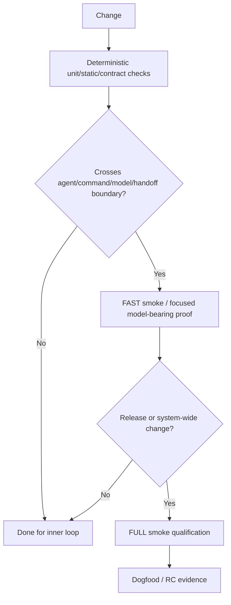

# SubhForge v0.2.0 — Qualification

**Status:** Draft reconciled to the clean v0.2 PRD, Discovery, Architecture and Workflow baseline  
**Date:** 2026-10-06

> **Authority relationship**
>
> - Product requirements: `design/prd/SUBHFORGE-V0.2-PRD.md`
> - Structural architecture: `design/architecture/SUBHFORGE-V0.2-ARCHITECTURE.md`
> - Workflow semantics: `design/workflow/SUBHFORGE-V0.2-WORKFLOW-CONTRACTS.md`
> - Live unresolved questions: `design/discovery/SUBHFORGE-V0.2-DISCOVERY.md`
> - This document: how v0.2 is proven
>
> Qualification validates accepted product/architecture/workflow contracts. It must not silently resolve an open `DI-###` or create a second definition of the behavior being tested.

The 2026-10-06 review additions are proposed proof obligations pending DI-001 acceptance; DI-013 freezes their executable cases/thresholds after the owning design decisions close. Listing a case is not evidence that it has passed.

---

## 24. Layered Validation Strategy

Framework validation is layered so expensive model-bearing smoke is used only
where it adds confidence.

Rules:

1. deterministic/local proof first;
2. FAST is not a per-edit ritual;
3. FULL is release/system-wide qualification, not normal development;
4. impact determines validation breadth;
5. any dedicated dry-orchestration/contract validator is **not assumed**; Discovery `DI-013` decides whether a minimal form earns its place;
6. FULL comes after cheap gates are green;
7. an early FULL run requires an explicit reason;
8. synthetic qualification complements real dogfood and must not become a substitute for it.

### 24.1 Performance budgets retained from hardening

For tiny default fixtures:

- FAST target ≤ **10 min**; investigate > **15 min**;
- FULL target ≤ **25 min**;
- FULL > **30 min** = `PERFORMANCE_BUDGET_EXCEEDED` unless explained by
  provider outage or explicit human wait;
- Claude runtime calls in smoke = **0 by default**;
- avoid repeated unchanged authority reads;
- runtime/workspace setup is deterministic.

Record raw wall time as well as any adjusted duration, with separately evidenced provider outage/human-wait exclusions. Never hide repeated reads, retries or local/tool overhead in those exclusions. Compare runs only with the same fixture/profile, host/toolchain and relevant execution configuration; attach those identities to timing evidence.

### 24.2 FULL execution design

FULL should:

- plan fixture once;
- create a clean checkpoint;
- fan independent scenarios out from disposable checkpoint copies;
- inject failures deterministically;
- assemble exact scenario context packets;
- invoke only the model judgement actually under test;
- reuse valid senior-review evidence unless review-relevant identity changed;
- bound retries;
- capture per-scenario timing/model/token data;
- keep fixture product complexity tiny.

### 24.3 Future targeted fixture candidates retained

These are **DEFERRED**, not default smoke fixtures.

| Fixture | Introduce when | Primary value |
|---|---|---|
| `full-frontend-app` | SubhForge changes frontend/browser/E2E/accessibility workflow | UI/browser/a11y verification |
| `full-event-worker` | SubhForge changes async/retry/idempotency/event guidance | Event/concurrency/recovery behavior |
| `full-cloud-iac` | SubhForge changes cloud/IaC/IAM/deployment verification | Cloud security/cost/recovery behavior |

Admission rule: add a fixture only when an existing fixture cannot meaningfully
validate a real framework capability, and keep runtime/token/external-cost
explicitly bounded.

---

### 24.4 Model / Harness Behaviour Drift Canary — ACCEPTED

A provider/model or harness update can change behavior even when SubhForge code has not changed.

The canary protects the PRD/Architecture rule that **agent responsibility and workflow semantics stay stable while model/provider/harness assignments remain replaceable execution policy**.

Maintain one **small behavioral compatibility canary** that exercises a minimal representative SubhForge path and checks deterministic expectations such as:

- artifact/work-item shape;
- required handoff behavior;
- mutation authority boundaries;
- lifecycle outcome;
- deterministic diagnostics/gates.

The canary must be cheap enough to run:

- when the configured model/provider materially changes;
- after a significant execution-harness upgrade or replacement;
- during release qualification;
- optionally from `/doctor` as a compatibility check.

The initial canary baseline is built during **RC1 implementation** and is part of the RC1 exit evidence so that it exists before major dogfooding begins.

This is an early-warning mechanism for external behavioral drift, not a replacement for dogfooding.

Qualification evidence must show both:

1. the release candidate passes the canary baseline; and
2. the canary detects at least one deliberately altered expectation during qualification.

---
### 24.5 Existing-authority admission regression — ACCEPTED

v0.2 must prove Workflow §9.2's product principle:

> **Valid upstream authority may be admitted without replaying authoring stages merely for ceremony.**

At minimum, qualification proves:

1. a valid existing PRD can enter the Architect path without replaying Ideation or PRD authoring;
2. valid accepted PRD + Architecture can enter planning/decomposition without replaying their authoring workflows;
3. admission checks current canonical authority, stable FR/NFR identity where applicable, material completeness/consistency, blockers/REC obligations and the receiving stage's ability to proceed without inventing intent;
4. a material product gap routes to the PRD-owning workflow rather than being silently repaired by Architect or Planner;
5. a material architecture gap routes to Architect rather than being silently decided by Planner/Builder;
6. invalid or uncertain authority fails closed through the appropriate blocker/escalation/`HUMAN_DECISION_REQUIRED` route;
7. admitted authority remains canonical Git authority and downstream work uses the normal traceability, readiness, dependency and evidence contracts;
8. admission proves validity, **not provenance**—SubhForge does not require evidence that SubhForge itself authored the document.

This is a real entry behavior, not a test-only bypass and not a compatibility bridge to v0.1.x.

---

### 24.6 Suite-ownership and grooming-resume regression — ACCEPTED

v0.2 qualification must prove the ownership and resumability contracts in Workflow §§10.5, 17.3 and 23.0.

At minimum:

1. Epic decomposition creates/designates an E2E-suite owning Feature before Epic delivery can complete.
2. Feature decomposition creates/designates an integration-suite owning Spec before Feature delivery can complete.
3. Builder/Implementer authors the corresponding suite code through tracked work; Verifier only runs/evidences it.
4. Missing expected behavior routes to the owning authority rather than being invented by Verifier or suite implementation.
5. A partially groomed Epic/Feature/Spec can return `*_CONTINUE`, persist safe progress, and later resume by re-invoking its owning command on the same durable ID.
6. Resume reconstructs from current backend/Git authority, revalidates blockers/parent drift, and does not require chat/session history.
7. A hard context ceiling returns `CONTEXT_CEILING_EXCEEDED` without dropping mandatory context; the next invocation resumes from persisted work rather than replaying the whole grooming session.

The regression should include an intentionally interrupted/budget-stopped grooming session so this behavior is proven, not only inferred.

---

### 24.7 Discovery intake and optional-research regression — ACCEPTED

Qualification must prove PRD FR-002 and Workflow §9.1 through both entry styles:

1. **Conversational intake:** Ideation interviews Subhadeep, creates/updates canonical discovery and persists material unanswered questions as durable research/decision work items.
2. **Document-led intake:** Subhadeep supplies notes/documents; Ideation extracts already-known facts/decisions without forcing restatement, identifies genuine gaps, updates discovery and creates only required durable open items.
3. **Subhadeep-performed research:** Subhadeep can attach/update evidence on a durable research item without invoking the Research Agent.
4. **Optional Research Agent:** when invoked, it can evaluate/synthesize available evidence and support closure without silently creating product authority.
5. Accepted conclusions are promoted into discovery by the owning workflow; raw evidence/chat output is not treated as canonical truth.
6. A later Ideation invocation resumes from current discovery + durable open items, not from the prior chat transcript.

---

### 24.8 Interaction-routing regression — ACCEPTED

Qualification must prove the Architecture §8.1 / Workflow §9.3 interaction contract:

- an owning Ideation/PRD/Architect workflow may initiate an interview for missing authority or consequential approval;
- when Subhadeep initiates a question against an existing artifact/work item, the default is bounded **explain/challenge**, not mutation;
- Planner/Reviewer/Verifier/Status can explain their rationale/context but cannot acquire upstream product/architecture mutation authority from the conversation;
- a conversation that becomes an authority-change request routes to the owning workflow;
- the implementation selected under Discovery `DI-008` must prove that conversational context alone cannot expand mutation permission.

---

### 24.9 Production-feedback and post-PR-boundary regression — ACCEPTED

Qualification must prove the v0.2 delivery boundary:

1. a proven production/runtime defect against existing accepted behavior enters Bug → Diagnose/Fix → Re-verify without unnecessary full reconciliation;
2. feedback that changes or exposes missing accepted requirements/architecture/acceptance/dependency/planned behavior enters Change Triage and, when material, Reconciliation;
3. post-PR deployment/release orchestration is not required for the SubhForge lifecycle to consider reviewed Spec delivery complete;
4. if optional PR creation is implemented under `DI-012`, failure of PR automation does not invalidate valid implementation/verification/review evidence and manual PR creation remains allowed.

### 24.10 Requirement coverage and measurable release gates — REVIEW (`DI-013`)

The following is a review coverage map, not a declaration of completeness or passed tests. DI-013 must freeze concrete cases, thresholds and artifact locations against the accepted revisions. A release record links each required property to current proof, owner and PASS/FAIL/explicit deferral. Missing proof is not PASS; changed authority/implementation invalidates affected qualification evidence.

| PRD requirement / constraint | Required proof surface | Current qualification home / design dependency |
|---|---|---|
| FR-001; NFR-009 | Durable mode, missing/conflicting marker, no silent switching; defined STANDARD regression | DI-004/011; RC1 + stable regression |
| FR-002 | Conversational/document intake, optional/manual research, durable frontier/resume | §24.7; DI-008 lifecycle closure |
| FR-003, FR-004, FR-005 | Valid direct admission, stable/retired IDs, protected invariant enforcement/conflict | §24.5, §30.2; DI-005/007/008 |
| FR-006, FR-007, FR-008 | Vertical decomposition, actionable owed contracts, gate invalidation, suite ownership; missing/retired links, cycles and cross-hierarchy eligibility | §24.6, §30.1–30.4; DI-003/005 |
| FR-009; NFR-007 | Read-only status/work-plan, correct blockers; partial/paginated/failed reads cannot appear empty or eligible | §30.3/30.4; DI-003/009 |
| FR-010, FR-011, FR-012, FR-013 | Distinct author/verify/review duties; exact tested baseline; effective gates, waiver limits, current AC-0; no routine Spec approval | §24.6, §30.1, §32; DI-005/008/014 |
| FR-014, FR-015 | Proven defect versus changed/missing authority; escaped-defect feedback; explicit local-lane approval; completed-parent fixes | §24.9, §30.2; DI-008 |
| FR-016 | Holds/overlap, protected conflicts, no-impact stopping, normalized replay, obligation closure and cancelled-pause recovery | §30.2; DI-006 |
| FR-017; NFR-001, NFR-002; CON-010 | Fresh-session continuation, uncertain-write recovery, no duplicate identities; export + matching Git restore | §24.6/30.4; DI-003/005/006/009 |
| FR-018; NFR-003 | Measure assembled context including mandatory authority/tool output; pressure and hard ceiling; safe continuation | §24.6, §30.3; DI-008/013 |
| FR-019; NFR-006 | Least privilege, denied write, untrusted-input authority expansion, secret-redacted context/log/export and removable tools | §30.4; DI-010 |
| FR-020; NFR-005 | Layer selection by failure class, negative canary, model/harness seams and required real dogfood | §24, §30, §31; DI-013 |
| NFR-004, NFR-008; CON-006, CON-007 | Measured calls/tokens/runtime/spend, bounded retry, explicit quota/auth/rate-limit failure, no silent paid fallback | §24.1, §30.3/30.4; DI-010/013 |
| NFR-010; CON-008 | Count avoidable versus reserved human interventions and recurring bookkeeping | §32; DI-013 |

For scale/context/cost/intervention claims, freeze before the qualifying run:

- workload: number of Epics/Features/Specs/claims, dependency depth/fan-in, authority/context size and meaningful session interruption;
- environment: supported OS/shell/Python, backend/adapter, SubhForge revision, fixture/profile and harness/model configuration;
- metric and threshold: tool calls/latency for status and next-work, context accounting, tokens/model calls/retries, variable cost and elapsed duration, recoverability and avoidable intervention;
- repeat policy and explicit exceptions, including how failures and requalification are handled;
- attribution: distinguish existing subscription cost, variable model spend, backend/storage/test-environment cost and human time; mark unavailable telemetry as unknown rather than zero.

Do not manufacture numeric targets during a review without workload evidence. DI-013 remains open until Subhadeep accepts realistic, bounded thresholds.

Additional focused qualification must prove:

1. Backend pagination/truncation/access failure cannot produce a false complete graph or unsafe eligibility; mutation conflicts and a lost successful-write response recover without duplicate creates or stale overwrite.
2. Authority changes after context assembly/before a hold or completion are detected and contained; revised verdict content cannot reuse approval for an earlier package.
3. Two child changes on separate branches are actually assembled and verified together; later code/contract/suite/environment changes cannot reuse unsupported freshness or human acceptance.
4. Recorded operational export plus matching Git references restores identities, relationships, holds/obligations and evidence meaning with no second live writable authority.
5. Windows/PowerShell bootstrap, interrupted discovery bootstrap and direct valid-authority admission work on the supported setup.
6. Injected instructions in notes/repository/tool output cannot expand write authority or expose secrets; denied/quota/authentication failures preserve safe progress and report the real cause without paid fallback.

Use deterministic proof for mechanical properties and the smallest real integration/model-bearing slice for boundaries it cannot prove alone.

---

## 30. Dogfood Sequence

### 30.1 MediBot — Greenfield LARGE

Prove the meaningful LARGE path:

`Conversational/document intake → Discovery → optional Research → PRD → Architecture →
Protected Invariants → selected operational work backend → Epic/Feature/Spec decomposition →
Work Plan/Status → Spec implementation → Verify → Review → optional PR handoff →
Feature verification + human acceptance → Epic verification + human acceptance`

Also prove:

- no parallel Markdown Epic/Feature/Spec hierarchy is required;
- the Research Agent is not mandatory when Subhadeep performs research;
- agent handoffs reconstruct from durable authority rather than chat memory;
- the post-PR production-release boundary does not leak into the delivery lifecycle.

---

### 30.2 MediBot + Evaluation Guardrails — Reconciliation

#### Reconciliation proof criterion — ACCEPTED

Reconciliation is considered **proven for RC3** only when the mandatory scenario set passes end to end against the **real implemented**:

- selected operational work backend;
- FR/NFR traceability model;
- Spec/Feature/Epic lifecycle states;
- verification/evidence freshness model;
- Protected Architecture Invariant enforcement model.

A mock that bypasses one of those real contracts is useful for development but does not satisfy this proof criterion.

The scenarios exercise normative rules in `design/workflow/SUBHFORGE-V0.2-WORKFLOW-CONTRACTS.md` §16/§17/§23 and `design/architecture/SUBHFORGE-V0.2-ARCHITECTURE.md` §5/§10.1. The pass conditions below are **qualification outcomes**, not alternative rule definitions.

| # | Scenario | Required pass outcome | Normative rule exercised |
|---:|---|---|---|
| 1 | No-impact authority change | Candidate work is inspected; unaffected branches remain untouched | Workflow §16 propagation/stopping + Architecture §10.1 |
| 2 | Future work / RETIRED requirement | Unstarted work is retained/repurposed/superseded/closed/replaced correctly; retiring an FR leaves **no dangling requirement trace** | Workflow §16 dispositions + Architecture §10.1 |
| 3 | Completed/verified work affected | **Only evidence whose claim/meaning is actually affected becomes stale**; required re-verification/new work is created | Workflow §16 + Workflow §23 |
| 4 | Cross-Feature dependency propagation | Impact crosses each real affected dependency edge and **stops at the first unaffected branch** | Workflow §§11,16 propagation/stopping |
| 5 | Cross-cutting NFR change/reclassification | Impact follows architecture/enforcement relationships to the correct scopes; **SCOPED ↔ CROSS_CUTTING reclassification is treated as `AUTHORITY_CHANGE`** | Architecture §10.1 + Workflow §16 |
| 6 | Protected invariant conflict | Conflict stops before unauthorized operational mutation and enters the protected architecture decision path | Architecture §5 + Workflow §16 |
| 7 | Partial APPLY failure / halted verdict | Retry derives state from backend postconditions, preserves already-satisfied ops, keeps held scope ineligible, and reaches intended final graph without duplicate logical mutation | Workflow §16.3–§16.5 |
| 8 | Legitimate LOCAL_REFINEMENT fast lane | Explicitly approved refinement proceeds without unnecessary PRD/architecture reconciliation | Workflow §17.1 |
| 9 | False-small authority change | Apparently small request that changes FR/NFR/architecture is routed out of fast lane | Workflow §17.1 + Workflow §16 |
| 10 | Missing traceability | Missing required trace stops/escalates; system never assumes the work is unaffected | Architecture §10.1 + Workflow §16 |
| 11 | In-flight Spec authority change | Affected `ACTIVE` Spec is paused with branch/worktree preserved; reconcile selects RESUME/ADAPT/SUPERSEDE **without finishing stale work or deleting useful implementation** | Workflow §16.1–§16.2 |
| 12 | APPLY succeeds with remaining REVERIFY/NEW_WORK_REQUIRED | Normal completion stays gated; explicitly approved verification/grooming can satisfy the obligation despite the REC's own gate; REC closes only at its defined obligation boundary | Workflow §16.6 review proposal |
| 13 | Unaffected/cancelled analysis with paused ACTIVE Spec | Current-authority and other-hold checks precede release; baseline refresh/tests can run through authorized recovery; Spec returns ACTIVE safely or remains visibly blocked | Workflow §§16.2,16.4,16.6 review proposals |
| 14 | Later operation overwrites an earlier postcondition | Invalid package is rejected before APPLY; normalized persistent effects survive retry, including crash after the last write | Workflow §16.3 review proposal |

#### Shared reconciliation fixture — ACCEPTED

The shared fixture is qualification-owned test data and is reset/mutated deterministically between scenarios. It contains:

- multiple Epics and Features;
- one COMPLETE Spec;
- one ACTIVE Spec with preserved branch/worktree;
- one `PAUSED_FOR_RECONCILE` Spec;
- one incomplete/halted REC with an earlier satisfied operation and later conflict;
- one not-started Spec;
- one active Feature whose latest verification/effective delivery gate is CLEAR but whose human `AC-0` acceptance is not yet ACCEPTED;
- one accepted/completed higher-level item;
- one Bug under a Feature;
- cross-Feature and cross-Epic dependency edges;
- active FR traces plus one RETIRED FR;
- one SCOPED NFR and one CROSS_CUTTING NFR tied to architecture/enforcement;
- at least one Protected Architecture Invariant;
- independent branches sufficient to prove propagation stopping.

#### Universal scenario assertions — ACCEPTED

Each scenario records its starting authority/work graph, expected classification, approved verdict/operation order, expected final state, expected evidence obligations and expected unaffected scope.

For every mutating verdict, the completed verdict must satisfy:

- final work graph matches the approved verdict;
- dependency graph is acyclic;
- all work-item, requirement and dependency references resolve;
- FR/NFR traceability is internally valid;
- lifecycle/evidence state is internally consistent;
- **evidence invalidation and re-verification obligations are correct and limited to affected claims/scopes**;
- unaffected-state preservation holds against the reconciliation baseline snapshot, ignoring unrelated out-of-scope human edits;
- every approved operation postcondition is satisfied (the Workflow §16.3 stable-postcondition rule applies);
- remaining follow-up obligations are visible and only their explicitly authorized satisfying operations can bypass that REC's own gate.

Per-operation idempotency, scope-hold, halted-verdict and overlap mechanics are asserted against Workflow §16.3–§16.5 rather than restated here.

Fixture mechanics may be refined during implementation/qualification, but mandatory scenario classes and pass outcomes cannot be weakened merely to simplify implementation. Open physical representation questions remain governed by Discovery until closed.

---
### 30.3 Autonomous Market Intelligence — Scale / Context

Prove:

- multiple Epics/Features/Specs;
- cross-hierarchy DAG sequencing;
- durable work-item-ID resume;
- bounded context;
- status projection;
- multi-session continuity;
- cost/token behavior.

---

### 30.4 Adversarial qualification catalogue — ACCEPTED

Representative deterministic/adversarial injections include:

- malformed or reformatted machine-significant metadata;
- invented/missing dependency or requirement IDs;
- duplicate work-item identity;
- missing governance/invariant reference;
- invalid acceptance-claim ID;
- evidence referencing a stale or retired claim;
- provider/contract changes after dependent work has progressed;
- broken or cyclic graph introduced before/during reconciliation;
- interruption between approved intent and completed backend mutation;
- forbidden authority mutation attempted by Builder/Fixer;
- repeated verify/fix/diagnose failure;
- retry/token budget exhaustion;
- omitted governing context;
- harness/model/tool failure mid-operation;
- model/provider/harness change that attempts to alter an agent's authority or handoff semantics;
- document-led Ideation that incorrectly invents missing decisions instead of creating durable open work;
- explain/challenge conversation that incorrectly mutates upstream authority;
- production defect misclassified as authority change, or authority change incorrectly waved through as a defect;
- corrupted/partial operational state;
- overlap/conflict between reconciliation packages;
- STANDARD regression caused by LARGE workflow changes.

Desired behavior:

> **Detect → contain → explain → repair automatically when mechanically safe →
> escalate when semantic judgement is required.**

Dogfood/release qualification may select the smallest representative subset needed to
cover each required failure class, but required system properties cannot be silently
dropped to preserve schedule.

---

## 31. Release Evidence

### RC1 — Walking skeleton and architecture implemented

Must show:

- accepted blocking Discovery decisions required by the implemented slice are closed/promoted;
- deterministic gates;
- Git / selected operational-work-backend authority boundary;
- work graph mechanics;
- protected-invariant guard;
- work-plan/status projection;
- durable resume/recovery paths;
- discovery intake + handoff behavior;
- behavioral drift canary;
- STANDARD protection defined by the resolution of Discovery `DI-011`.

### RC2 — Greenfield delivery

MediBot proves meaningful LARGE lifecycle and recovery.

### RC3 — Evolution/reconciliation

RC3 passes only when the **§30.2 Reconciliation proof criterion** is satisfied.

Guardrails additionally prove:

- authority evolution;
- invariant enforcement;
- planner verdict;
- human approval;
- safe selected-backend application;
- impact/evidence invalidation;
- implementation + re-verification.

### Stable v0.2.0

Requires:

- all release-blocking Discovery questions required by v0.2 scope are closed and promoted (release criticality is distinct from a DI's BLOCKED work status);
- larger-scale/context qualification;
- STANDARD + LARGE regression against the accepted `DI-011` compatibility boundary;
- install/bootstrap/doctor/release checks;
- required adversarial cases;
- model/harness behavioral canary;
- acceptable runtime/token/provider-cost behavior;
- sufficient diagnostics/recovery;
- temporary construction/review scaffolding is not required for product operation;
- final release bar accepted by Subhadeep.

The release evidence record must identify the exact SubhForge/Git/backend-schema/configuration revisions under test, reference the frozen §24.10 coverage/thresholds, and link results, exceptions and any required reruns. RC labels identify evidence bundles, not substitute schedules or automatic promotions.

Dogfood evidence is not removed merely to preserve schedule.

---

## 32. SubhForge Intervention Tally

The most meaningful operational metric is:

> **How often does SubhForge force Subhadeep to understand or repair SubhForge
> internals while trying to build a product?**

For meaningful dogfood interruptions record:

- operation/project;
- failure category;
- whether diagnosis was correct;
- automatic/guided/manual recovery;
- approximate human intervention.

Also count recurring cases where Subhadeep must manually:

- reconstruct project status;
- choose work that the graph could derive;
- reload broad history just to give an agent context;
- approve routine Spec progression/completion despite no reserved human decision;
- answer a decision that is already settled in current authority;
- coordinate an agent handoff that SubhForge could perform from durable state;
- handle separately interrupting decisions that could safely have been batched.

Repeated occurrences are product/architecture evidence.

Dogfood must explicitly inspect human decision load, not only command correctness. Routine Spec approval requests are a contract violation; avoidable handoff/decision repetition is evidence that the workflow needs simplification rather than additional tolerance from Subhadeep.

For VidyaBeacon this should approach zero.

---
