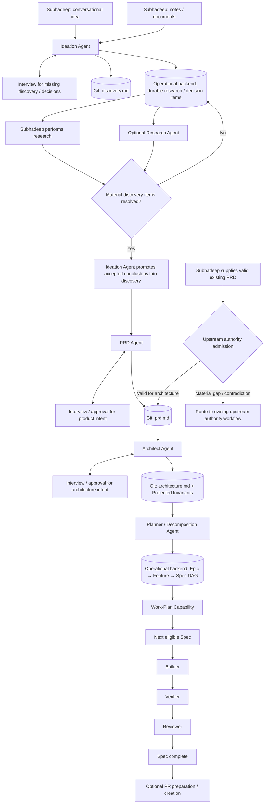
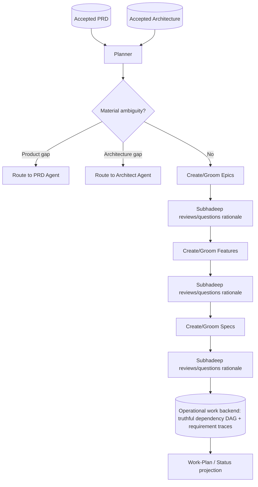
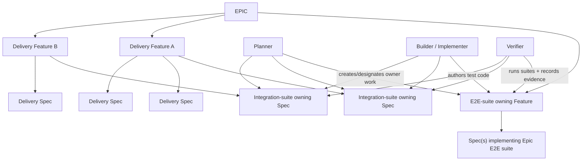
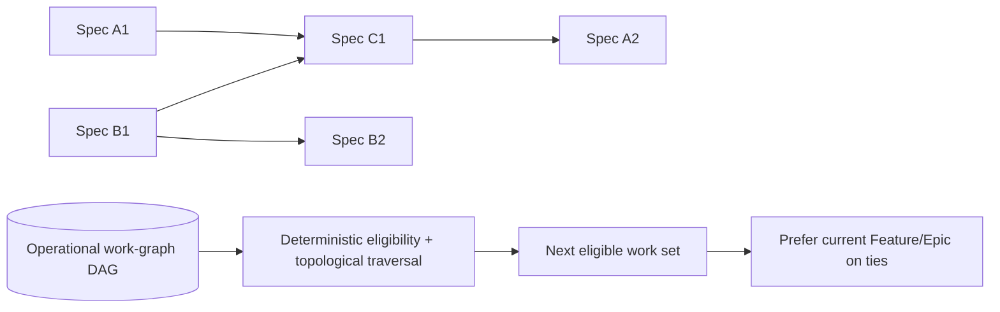
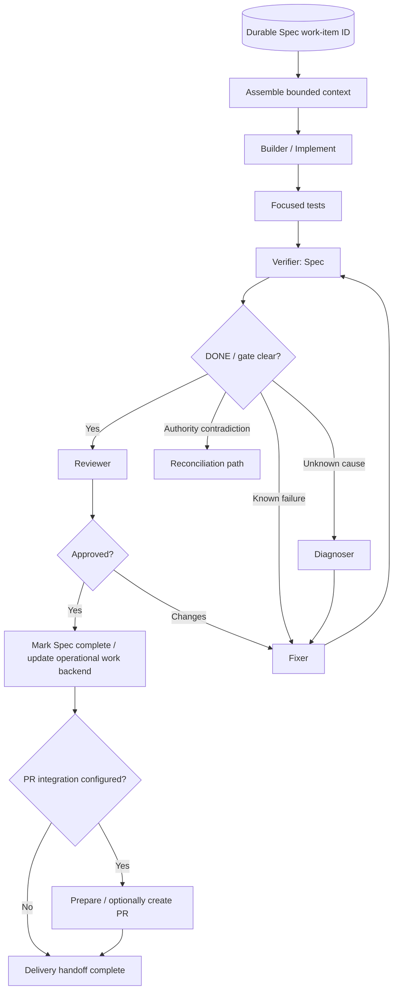
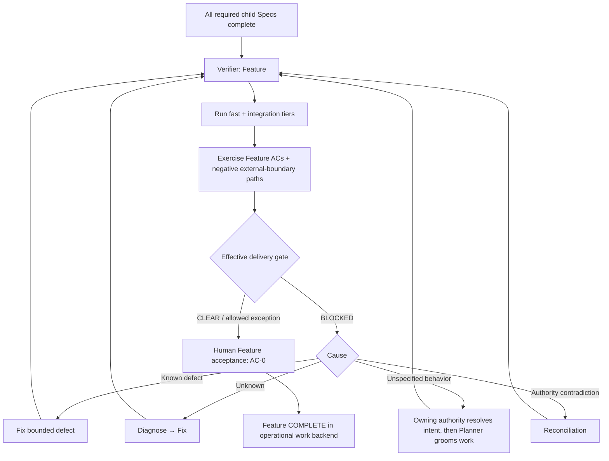
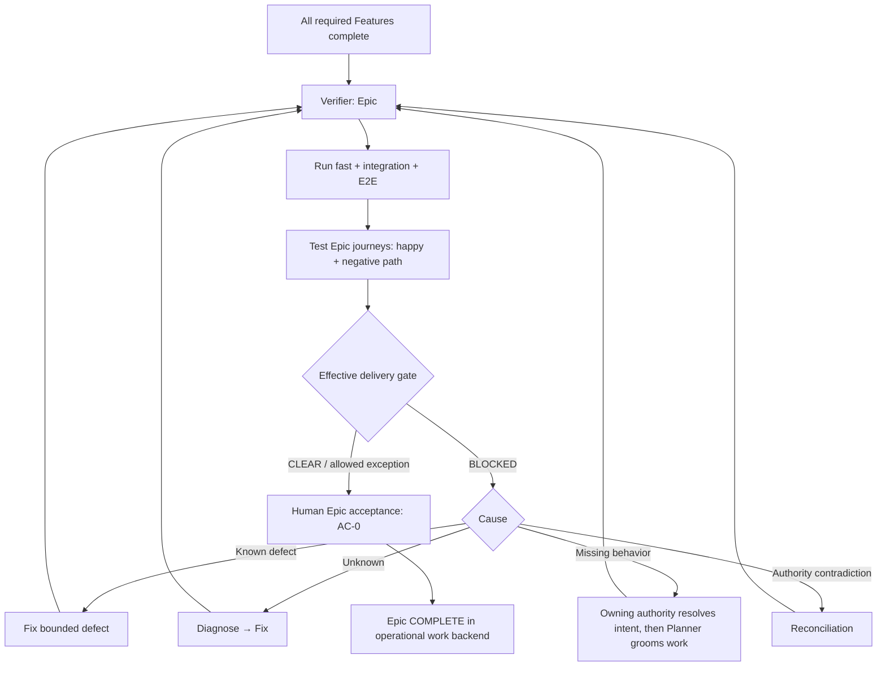
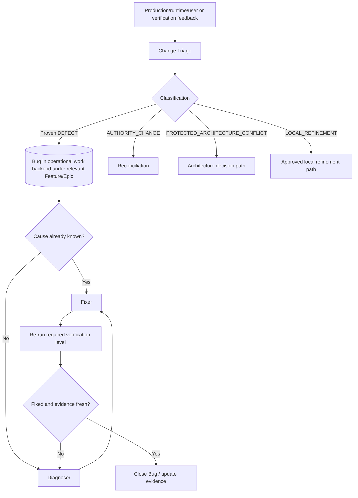
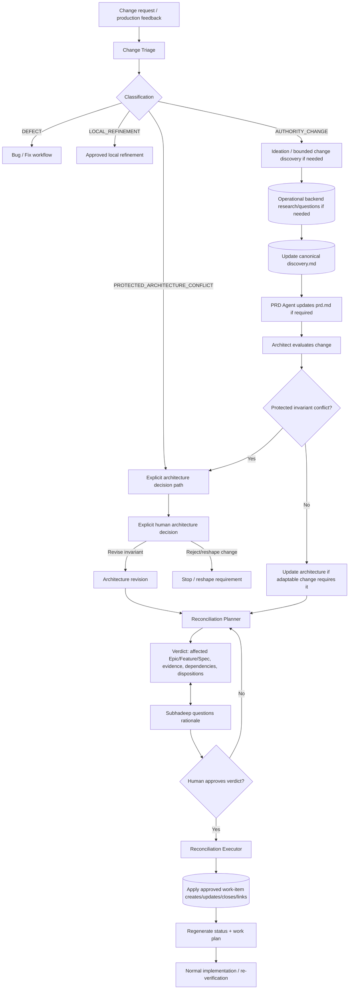
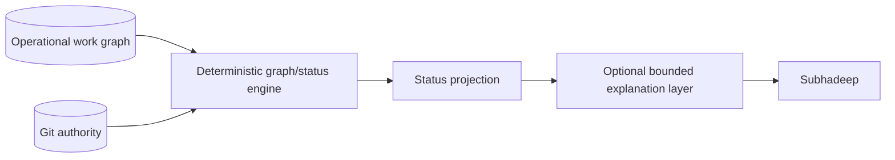

# SubhForge v0.2.0 — Workflow Contracts

**Status:** Draft reconciled to the clean v0.2 PRD, Discovery and Architecture baseline  
**Date:** 2026-10-06

> **Authority relationship**
>
> - Product requirements: `design/prd/SUBHFORGE-V0.2-PRD.md`
> - Structural architecture: `design/architecture/SUBHFORGE-V0.2-ARCHITECTURE.md`
> - Live unresolved questions: `design/discovery/SUBHFORGE-V0.2-DISCOVERY.md`
> - This document: normative lifecycle/workflow semantics
>
> Physical command/agent/backend representation that remains open under a `DI-###` must not be guessed here. Qualification should prove these contracts rather than redefine them.

The 2026-10-06 review corrections below are proposals pending DI-001 acceptance. Revised reconciliation contracts also require DI-006's physical design and proof before implementation.

---

## 1. Workflow Scope — ACCEPTED

SubhForge v0.2 workflow responsibility is bounded as follows:

- **Requirement → Spec:** core workflow.
- **Spec → reviewed implementation:** core workflow. Optional PR preparation/creation may follow review but is not a release gate.
- **PR → Production:** outside the primary v0.2 workflow; post-PR organizational review, deployment and release orchestration are not modeled here.
- **Production/runtime/user feedback → delivery authority:** re-enters through Change Triage. Proven defects against accepted behavior use Bug/Fix; material authority changes use Reconciliation.

No PR or deployment lifecycle state is added merely to represent systems outside SubhForge's v0.2 boundary.

---

## 2.4 Lifecycle State Machine — ACCEPTED

Lifecycle state is persisted in the selected operational work backend. Git remains the authority for canonical product/architecture/code truth; lifecycle history comes from backend history plus Git/PR evidence where applicable.

### States and allowed transitions

This table currently defines Project/Epic/Feature/Spec only. Bug, Idea/Research and REC operational lifecycles are not implicitly covered by it. DI-008 must define their minimum owners, guards and outcomes before the corresponding capabilities are implemented.

| Type | States | Allowed transitions |
|---|---|---|
| **Project** | `DISCOVERY`, `PLANNING`, `ACTIVE`, `MAINTENANCE`, `PAUSED`, `COMPLETE`, `RETIRED` | `DISCOVERY → {PLANNING, PAUSED, RETIRED}`; `PLANNING → {ACTIVE, PAUSED, RETIRED}`; `ACTIVE → {MAINTENANCE, COMPLETE, PAUSED, RETIRED}`; `MAINTENANCE → {ACTIVE, COMPLETE, PAUSED, RETIRED}`; `PAUSED → {resume_state, RETIRED}`; `COMPLETE → RETIRED` |
| **Epic** | `DRAFT`, `GROOMING`, `READY_FOR_FEATURE_DECOMPOSITION`, `ACTIVE`, `COMPLETE`, `RETIRED` | `DRAFT → {GROOMING, RETIRED}`; `GROOMING → {READY_FOR_FEATURE_DECOMPOSITION, RETIRED}`; `READY_FOR_FEATURE_DECOMPOSITION → {ACTIVE, RETIRED}`; `ACTIVE → {COMPLETE, RETIRED}`; `COMPLETE → RETIRED` |
| **Feature** | `DRAFT`, `GROOMING`, `READY_FOR_SPEC`, `ACTIVE`, `COMPLETE`, `RETIRED` | `DRAFT → {GROOMING, RETIRED}`; `GROOMING → {READY_FOR_SPEC, RETIRED}`; `READY_FOR_SPEC → {ACTIVE, RETIRED}`; `ACTIVE → {COMPLETE, RETIRED}`; `COMPLETE → RETIRED` |
| **Spec** | `DRAFT`, `READY_FOR_IMPLEMENTATION`, `ACTIVE`, `PAUSED_FOR_RECONCILE`, `COMPLETE`, `RETIRED` | `DRAFT → {READY_FOR_IMPLEMENTATION, RETIRED}`; `READY_FOR_IMPLEMENTATION → {ACTIVE, RETIRED}`; `ACTIVE → {PAUSED_FOR_RECONCILE, COMPLETE, RETIRED}`; `PAUSED_FOR_RECONCILE → {ACTIVE, RETIRED}`; `COMPLETE → RETIRED` |

`RETIRED` is terminal.

`ACTIVE` is the canonical execution-state name across Epic, Feature and Spec. The interim split term `IN_PROGRESS` is not a lifecycle state.

### Lifecycle invariants

- **No general BLOCKED/RECONCILING/VERIFYING/VERIFIED/FAILED/DECISION_REQUIRED states.** Blocking, verification and reconciliation are overlays except for the deliberately added Spec state `PAUSED_FOR_RECONCILE`, whose purpose is to fail closed around an open implementation branch when accepted authority is changing.
- **No backward moves.** `GROOMING → DRAFT` is forbidden and `COMPLETE` never reopens. Project `MAINTENANCE → ACTIVE`, Project `PAUSED → resume_state`, and Spec `PAUSED_FOR_RECONCILE → ACTIVE` are explicit resume transitions, not re-authoring shortcuts.
- **Transition validity:** an allowed edge, all transition guards and a successful authoritative backend persist are required. The state write and related transition metadata are atomic from SubhForge's perspective.
- An illegal transition returns `INVALID_LIFECYCLE_TRANSITION` with current state, requested state, allowed states and reason.
- If a required authoritative lifecycle write cannot be established, return `PERSISTENCE_FAILURE`; never emit a success token first.
- **Retirement is explicit.** It is never inferred from age/inactivity. Authorization is either a direct Subhadeep retirement request or an approved reconciliation verdict that explicitly carries the `RETIRE_REQUIRED` disposition/obligation.
- A Spec ambiguity during implementation does not invent a lifecycle state; keep the current state and create/update the appropriate ESC/BLK path unless reconciliation itself requires `PAUSED_FOR_RECONCILE`.
- Verification remains an evidence/gate overlay; passing verification does not create a `VERIFIED` lifecycle state.

### Transition owners and guards

| Transition | Performed by | Guard / trigger |
|---|---|---|
| create Project → `DISCOVERY` | `/ideate` | first durable LARGE-project ideation state is established |
| Project `DISCOVERY → PLANNING` | `/ideate` | `IDEATION_READY_FOR_PRD` |
| Project `PLANNING → ACTIVE` | `/project-init` | accepted PRD + architecture + repository baseline + operational work backend initialization are ready |
| Project `MAINTENANCE → ACTIVE` | owning Project/Epic lifecycle path | new delivery work is explicitly resumed and the first Epic is ready to proceed |
| Project → `MAINTENANCE / COMPLETE / PAUSED / RETIRED`, and `PAUSED → resume_state` | explicit Subhadeep-authorized Project lifecycle action through the deterministic backend adapter | requested transition is allowed and project-level guards pass |
| create Epic/Feature → `DRAFT` | Planner / owning `/epic` or `/feature` path | intent is durably created |
| Epic/Feature `DRAFT → GROOMING` | owning `/epic` / `/feature` | grooming begins |
| Epic `GROOMING → READY_FOR_FEATURE_DECOMPOSITION` | `/epic` | §10.3 Epic readiness gate passes |
| Feature `GROOMING → READY_FOR_SPEC` | `/feature` | §10.3 Feature readiness gate passes |
| Epic `READY_FOR_FEATURE_DECOMPOSITION → ACTIVE` | `/feature` | first durable child Feature is created/admitted |
| Feature `READY_FOR_SPEC → ACTIVE` | `/spec` | first durable child Spec is created/admitted |
| Spec `DRAFT → READY_FOR_IMPLEMENTATION` | `/spec` | §10.3 Spec readiness gate passes |
| Spec `READY_FOR_IMPLEMENTATION → ACTIVE` | `/implement` | prerequisites/dependencies are valid and execution is admitted |
| Spec `ACTIVE → PAUSED_FOR_RECONCILE` | deterministic reconciliation-control layer | reconciliation analysis places the active Spec inside the held candidate scope |
| Spec `PAUSED_FOR_RECONCILE → ACTIVE` | reconciliation resume path | approved `RESUME_UNCHANGED` or `ADAPT/REPURPOSE`, or safe recorded no-impact/cancellation restoration under §16.4; §16.2 baseline refresh + required affected tests pass |
| Spec `ACTIVE → COMPLETE` | `/review` | final `APPROVE`; effective Spec delivery gate is clear/allowed exception; no open blocking ESC/BLK/REC obligation references the Spec |
| Feature `ACTIVE → COMPLETE` | `/feature <ID> complete` | every non-RETIRED child Spec COMPLETE; Feature verification/effective gate passes; human `AC-0` accepted; no blocking ESC/BLK/REC/owed-contract obligation remains |
| Epic `ACTIVE → COMPLETE` | `/epic <ID> complete` | every non-RETIRED child Feature COMPLETE; Epic verification/effective gate passes; human `AC-0` accepted; no blocking ESC/BLK/REC/owed-contract obligation remains |
| any non-RETIRED work item → `RETIRED` | owning lifecycle capability under explicit human authorization | no unsafe live dependents remain, or an approved REC has assessed them and carries the retirement obligation |

### Completion and Project preconditions

- Completion is explicit and guard-driven; it is never inferred from elapsed time or child counts alone.
- Epic/Feature completion has a hard floor: every non-RETIRED child must already be COMPLETE.
- Project completion is a human judgement and is not derived automatically from Epic completion.
- Mutating LARGE delivery commands require Project state compatible with the action. In particular, new Epic delivery requires Project `ACTIVE` or `MAINTENANCE`.
- When Project is `PAUSED`, `COMPLETE` or `RETIRED`, normal mutating LARGE commands fail closed unless the requested operation is an explicitly allowed human-owned lifecycle transition.
- Read-only `/status` remains available regardless of Project lifecycle state.

### Bootstrap and direct-admission boundary — REVIEW (`DI-003`, `DI-004`, `DI-008`)

Ideation already needs an operational backend for Project and research identities, before `/project-init` admits delivery. The backend binding/bootstrap therefore cannot first become available at delivery initialization. The owning DIs must distinguish minimum discovery bootstrap from the later repository/delivery baseline, and prove interrupted bootstrap can resume without duplicate Project/research items.

Direct admission under §9.2 must also establish Project identity, selected mode, backend binding and the appropriate PLANNING entry without fabricating completed Ideation history. Define that entry/transition explicitly in DI-008; the `/ideate` transition in the table is not permission to invent provenance. DI-004 owns the supported local execution environment and mode/config bootstrap contract.

---

## 8.3 Escalation Model

The escalation model is **ACCEPTED**.

Escalation ladder:

```text
LOCAL_IMPLEMENTATION_CHOICE
    → agent may decide

SPECIFICATION_CLARIFICATION_REQUIRED
    → accepted behavior is insufficiently clear

ARCHITECTURE_ESCALATION_REQUIRED
    → durable system-level constraint / boundary / pattern is unclear or must change

HUMAN_DECISION_REQUIRED
    → Subhadeep's priorities, risk, cost, lock-in, scope or reserved decision is required
```

Classification rules:

- a local implementation choice must not change accepted behavior, acceptance, external contracts, project policy or architecture, and must be safely reversible without migration/coordination;
- tests may verify accepted behavior but may not invent the expected behavior;
- material behavioral ambiguity routes to specification clarification;
- establishing/changing/reinterpreting durable system-level constraints routes to architecture escalation;
- decisions depending on Subhadeep's priorities/trade-offs route to `HUMAN_DECISION_REQUIRED`;
- developer-reserved decisions recorded in the owning authority are always treated as `HUMAN_DECISION_REQUIRED`;
- cumulative effect is assessed within the current invocation's scope; there is no cross-invocation aggregation mechanism in v0.2, with `/review` and `/adversarial-check` as the backstop;
- classify conservatively when autonomy requires material argument about unstated intent.

### Blocking, pause and resume

Blocking is a **property, not an escalation category**. The test is:

> Would the affected work remain correct under every reasonable resolution?

If not:

- block/pause only the narrowest dependent scope;
- independent safe work continues;
- a paused path never proceeds using placeholders, weakened checks or premature completion;
- if blocked scope widens, update the existing escalation record rather than creating a duplicate.

Resume requires all of:

1. the resolution has been promoted into the authority that semantically owns it;
2. Subhadeep explicitly re-invokes the owning workflow/capability;
3. current state proves the path is safe, including that no dependent reconciliation remains pending.

Valid independent work is preserved and control returns to the owning workflow.

### Durable escalation record

Every escalation uses a durable `ESC-###` record with this envelope:

```text
ESCALATION REPORT
Classification
Origin
Unresolved decision
Why escalation is required
Authority consulted
Options / interpretations
Technical assessment
Blocking assessment
Blocked work
Safe continuation (mandatory; "None" + reason if none)
Resolution required
Owner
```

Rules:

- normally one unresolved decision per ESC record;
- complete bounded discovery before escalating, then stop searching once the threshold is met;
- store references/conclusions rather than copied context/transcripts;
- the selected operational work backend must persist the `ESC-###` identity, status, blocked scope, owner and report reference; exact backend representation is resolved through Discovery `DI-003`;
- the escalation record is operational provenance, **not** product/architecture authority;
- the final answer is promoted into the canonical authority that semantically owns it;
- a genuine specification clarification produces an owning-authority edit;
- changes to COMPLETE/accepted authority go through reconciliation;
- rejected options never become truth;
- ESC records remain durable and are loaded on demand rather than being default context.

Durable-knowledge test:

> **If the ESC record disappeared, would the accepted decision still be discoverable from its owning authority?**

If not, the resolution was not promoted correctly.

### Durable blocker record

A blocker is distinct from an escalation:

- `ESC-###` = unresolved **decision**;
- `BLK-###` = unavailable prerequisite, evidence, access or authority needed to proceed.

A durable `BLK-###` records:

- affected work item/scope;
- missing condition;
- responsible owner;
- discovered-at context;
- unblock-check condition;
- status.

The selected operational work backend persists blocker identity/status/scope. A blocker is operational provenance, not product/architecture authority. When the unblock condition becomes true, the owning workflow revalidates current authority before resuming.

---

## 9. Normal Greenfield LARGE Workflow



### 9.1 Ideation contract — ACCEPTED

For LARGE projects, Ideation accepts either a conversational idea or existing notes/documents supplied by Subhadeep.

The Ideation Agent:

1. extracts already-known facts/decisions from supplied material;
2. actively interviews Subhadeep only for missing discovery information or reserved decisions;
3. updates canonical discovery;
4. creates durable research/decision work items for material questions that cannot yet be answered.

Ideation uses two coordinated authorities:

- canonical `discovery.md` in Git for durable discovery truth;
- operational Idea/Research items for unresolved evidence/research work.

The discovery authority should capture at minimum:

- Problem & Outcome;
- Users / Actors;
- Success Measures;
- Scope / Non-Goals;
- Core Journeys;
- Binding Constraints;
- Confirmed Decisions with stable `D-n` identifiers where useful;
- Decision Frontier (blocking vs non-blocking open decisions);
- Assumptions with evidence needed to confirm/refute them;
- Developer-Reserved Decisions.

Research conclusions that become accepted product truth are promoted into `discovery.md`; raw research work remains operational evidence/work state.

The **Research Agent is optional**. Subhadeep may research a durable item himself and attach/update the evidence. If invoked, the Research Agent evaluates/synthesizes the evidence, identifies whether the item can close, and helps the Ideation Agent promote justified conclusions into discovery. Neither user-supplied evidence nor Research-Agent output silently becomes product authority until the owning Ideation/PRD workflow accepts/promotes it.

Ideation outcomes:

- **`IDEATION_CONTINUE`** — meaningful progress is persisted and at least one safe independent discovery/research path remains;
- **`IDEATION_READY_FOR_PRD`** — nothing material remains that PRD would have to invent; bounded/non-blocking unknowns may remain with owners;
- **`IDEATION_BLOCKED`** — required evidence/access is unavailable and no safe bounded assumption exists; persist/link a `BLK-###`.

Resume always reconstructs from current `discovery.md` + open operational Idea/Research/ESC/BLK records. Later accepted-product change does not reopen old ideation state blindly; it enters normal change triage/reconciliation.

Contradictions against Confirmed Decisions or Binding Constraints are surfaced before PRD readiness. Before downstream authority exists they can be resolved as discovery edits; after accepted PRD/architecture exists, normal change governance applies.

### 9.2 Existing Authority Admission — ACCEPTED

Principle:

> **Do not force Subhadeep to replay upstream workflow stages merely to prove that already-valid authority exists.**

A downstream owning workflow may start directly when all authority it requires already exists and passes its admission checks.

Primary v0.2 example:

```text
Subhadeep supplies a valid PRD
        ↓
upstream-authority admission check
        ↓
/architect
        ↓
architecture
        ↓
planning / decomposition
```

In that path, `/ideate` and `/prd` are **not required merely for ceremony or provenance**.

The same principle applies at later boundaries when the required upstream authority already exists; for example, accepted PRD + accepted architecture may admit planning without replaying their authoring workflows.

#### Admission rules

Existing-authority admission skips **stage execution**, not correctness checks.

Before admitting a supplied upstream authority, the receiving workflow verifies only what it needs to consume that authority safely:

- the authority is durably available in its canonical Git location or is explicitly supplied for canonical admission;
- identity/schema required by the receiving stage is valid, including stable FR/NFR identity where applicable;
- required scope/constraints/acceptance intent are sufficiently complete for the receiving stage;
- there is no unresolved material contradiction inside the supplied authority;
- no blocking ESC/BLK/REC obligation makes the authority unsafe to consume;
- the receiving agent can proceed without inventing product/architecture intent.

The admission check does **not** require proof that SubhForge itself authored the document.

If a supplied PRD is complete and valid for architecture, Architect consumes it directly.

If it has a material product gap, Architect does not repair/invent that product authority. It routes the gap to the PRD-owning workflow. That workflow may normalize/fix the supplied PRD without forcing a fresh ideation cycle unless discovery itself is genuinely required.

If validity is uncertain, return `HUMAN_DECISION_REQUIRED` or the appropriate upstream blocker rather than silently accepting or re-running every earlier stage.

#### Authority/history rule

After admission, the supplied document becomes/continues as the canonical authority in Git. Normal later material changes go through Change Triage and, when required, Reconciliation. Existing-authority admission is an **entry optimization**, not a parallel authority model.

Key rules:

- no PRD while material discovery questions remain;
- no decomposition before accepted PRD + architecture;
- Planner does not invent missing requirements;
- implementation starts from an implementation-ready Spec;
- the selected operational work backend is updated after accepted lifecycle transitions.

### 9.3 Interaction routing — ACCEPTED

Workflow behavior follows Architecture §8.1.

- **Owning workflow → Subhadeep:** Ideation, PRD and Architect may interview for missing authoritative information or a consequential decision/approval.
- **Subhadeep → Agent:** a conversation about an existing artifact/work item defaults to bounded explain/challenge behavior.
- If the conversation becomes a request to change accepted authority, the receiving agent routes it to the workflow that owns that authority.
- Planner, Reviewer, Verifier, Status and other downstream capabilities do not gain authority merely because Subhadeep is chatting with them.
- Exact implementation of interaction-mode detection remains open under Discovery `DI-008`.

---

## 10. Planning / Decomposition Workflow

---

> Requirement identity and traceability are defined in `design/architecture/SUBHFORGE-V0.2-ARCHITECTURE.md` §10.1.

---

### 10.2 Planning / Decomposition Flow



Decomposition intent:

- **Epic:** manageable, human-verifiable end-to-end outcome.
- **Feature:** human-verifiable capability within an Epic.
- **Spec:** smallest implementation-ready behavioral slice an agent can implement end to end.

A rough **5–8 Epics** is a useful heuristic for projects at our expected scale,
not a hard quota.

---

### 10.3 Grooming / readiness gates — ACCEPTED

> **A work item is ready when the next stage can proceed without inventing material intent.**

Common gate rules for Epic, Feature and Spec:

- governing PRD/architecture authority is accepted and current;
- relevant FR/NFR traces are present and valid;
- dependencies/contracts required by the next stage are consumable or have a named
  tracked owner; an undecided required contract blocks readiness;
- a pending required contract creates or links a **tracked grooming obligation** on the expected-owner scope so the blocker becomes actionable work rather than inert metadata;
- provider-side readiness checks include contracts the scope owes to known consumers;
- if the expected owner itself is ambiguous, return `HUMAN_DECISION_REQUIRED` rather than invent ownership;
- no blocking dependency cycle exists;
- no blocking escalation, blocker, reconciliation hold or incomplete/halted REC affects
  the item; an explicitly authorized REC-obligation operation follows §16.6 and must still satisfy all other guards;
- non-blocking open questions have an owner and are explicitly safe to defer;
- parent/ancestor authority is in a compatible state;
- material upstream drift has been reconciled before readiness is claimed.

Level-specific gates:

**Epic → READY_FOR_FEATURE_DECOMPOSITION**

- human-evaluable end-to-end outcome and observable surface;
- scope boundaries and non-goals;
- traced functional requirements plus applicable cross-cutting NFR/architecture policy;
- acceptance intent, including human acceptance `AC-0`;
- verification intent including representative happy + negative E2E journeys;
- **E2E-suite ownership is declared:** name the child Feature that owns those Epic journeys, or declare the Feature role that `/feature` must materialize/designate during decomposition;
- foundation/enabler prerequisites identified.

**Feature → READY_FOR_SPEC**

- human-evaluable capability and observable surface;
- scope, integration/contract boundaries and non-goals;
- stable acceptance criteria with human capability `AC-0`;
- integration verification intent and E2E where required;
- **integration-suite ownership is declared:** name the child Spec that owns the Feature integration suite, or declare the Spec role that `/spec` must materialize/designate during decomposition;
- contracts provided/consumed are explicit;
- candidate implementation slices are coherent enough to decompose without inventing intent.

**Spec → READY_FOR_IMPLEMENTATION**

- bounded implementation-ready behavior;
- every acceptance criterion has a stable `AC-*` identity and is objectively verifiable;
- testing requirements cover relevant seams plus negative/boundary behavior;
- TDD applicability and verification requirements are explicit;
- provided/consumed contracts are explicit;
- expected context fits the 5–15k Spec target or `SPEC_CONTEXT_PRESSURE` is recorded;
- no open material behavioral ambiguity remains.

Questioning / routing discipline:

1. evaluate only gate items unresolved by current authority/repository evidence;
2. research external facts before escalating a decision gap;
3. if a gate exposes missing **product intent**, persist/route the gap to the PRD-owning upstream workflow; if it exposes missing **architecture intent**, persist/route it to the Architect;
4. Planner does **not** ask Subhadeep to invent or settle upstream product/architecture intent directly; the owning upstream agent may grill Subhadeep under its own authority;
5. batch related upstream gaps into one bounded decision frontier;
6. stop once the gate passes;
7. never re-ask a persisted answer.

---

### 10.4 Platform / Enabler / cross-cutting work — ACCEPTED

Do not invent special lifecycle types merely for foundations.

- cross-cutting **policy** belongs in PRD/Architecture governance, not as fake implementation work;
- shared infrastructure/capability is ordinary Feature/Spec work, optionally marked `Kind: ENABLER` in backend metadata;
- the first LARGE delivery path should establish a minimal **Foundation / Walking Skeleton** sufficient to deploy and verify later vertical slices;
- typical foundations include CI/CD, configuration, logging/tracing, authn/authz baseline, persistence/test foundations where required by accepted architecture;
- an Enabler is groomed only when accepted architecture requires it or real downstream work consumes/depends on its contract;
- speculative reusable infrastructure is not front-loaded merely because it might be useful later;
- enablers use the same dependency, verification and completion semantics as ordinary work.

Consumers depend on the enabler's usable contract/capability, not on ceremony around its label.

---

### 10.5 Verification-suite work ownership — ACCEPTED

Higher-level verification needs **planned implementation work that authors the suites**. The Verifier only executes/verifies evidence; it does not invent expected behavior or become the hidden author of integration/E2E tests.

Ownership model:



Rules:

- **Every Epic has one primary E2E-suite owning Feature.**
  - It may be a dedicated Feature or an explicitly designated existing child Feature.
  - It owns the implementation work for the Epic's happy/negative end-to-end journeys derived from the Epic verification intent/ACs.
- **Every Feature has one primary integration-suite owning Spec.**
  - It may be a dedicated Spec or an explicitly designated existing child Spec.
  - It owns the implementation work for tests proving the Feature's child Specs collaborate across their real contracts/boundaries.
- `/feature` must materialize/designate the Epic E2E owner as part of Feature decomposition.
- `/spec` must materialize/designate the Feature integration owner as part of Spec decomposition.
- The owner designation is durable operational metadata/reference in the selected work backend; exact physical field/label is resolved through Discovery `DI-003`.
- Planner defines/links the suite-owning work from already accepted Epic/Feature verification intent. Planner does not invent product behavior merely to create tests.
- Builder/Implementer writes and maintains the suite code through the normal implementation lifecycle of the owning Feature/Spec's child work.
- Verifier **runs** the appropriate suite and records immutable evidence. Verifier does not author missing expected behavior or silently create tests as an untracked side effect.
- Expected assertions come from accepted ACs, journeys, contracts, architecture/invariant obligations and testing requirements. A missing expectation is routed to its owning authority, not guessed by the suite.
- Supporting tests may live near production code where technically appropriate, but the work graph still has exactly one primary owner for suite completeness/maintenance so responsibility is not ambiguous.
- The E2E-suite Feature is still an ordinary Feature for lifecycle/dependency purposes. It may use one of its child Specs as its own integration-suite owner; no special lifecycle type is introduced.
- Suite ownership is a reference/designation, not a new dependency or a requirement to create another dedicated suite-owning child recursively. An existing delivery Feature/Spec may own its own required suite. This avoids an infinite hierarchy of test-only owners.

Completion consequence:

- a Feature cannot complete unless its integration-suite owner exists, required owner work is COMPLETE, and the applicable Feature integration gate/evidence is current;
- an Epic cannot complete unless its E2E-suite owner Feature exists, required owner work is COMPLETE, and the applicable Epic E2E gate/evidence is current.

---

## 11. Work-Plan and DAG Workflow

Dependencies are a **DAG**, not a linked list.



Rules:

- dependency edges represent real prerequisites only;
- work may cross Epic/Feature boundaries;
- starting one Epic does not require finishing it before another Epic;
- when several items are equally eligible, prefer continuity to reduce context
  switching;
- never invent an edge simply to create a convenient sequence;
- a Spec in `PAUSED_FOR_RECONCILE` is **not eligible work**;
- any downstream item whose real prerequisite chain passes through that paused
  Spec is derived as temporarily ineligible;
- independent eligible work remains available, so one reconciliation pause does
  **not** freeze the whole project;
- dependent items do not themselves enter `PAUSED_FOR_RECONCILE`; their
  ineligibility is derived from the DAG rather than persisted as duplicate state;
- any work item inside the candidate/touched scope of an **analysing, awaiting-approval,
  applying, incomplete or halted REC** is ineligible for normal work-plan selection;
  explicitly authorized recovery/obligation work is governed by §16.6 and does not become ordinary eligible work merely because it would help close a REC;
- if such a held item is an `ACTIVE` Spec, it is additionally persisted as
  `PAUSED_FOR_RECONCILE` to protect its open implementation branch/worktree;
- downstream items depending on that reconciling scope are derived as temporarily
  ineligible, while unrelated work remains available.

---

## 11A. Dependency Relationship and Impact Semantics — ACCEPTED

There are exactly three relationship kinds in the operational work graph:

1. **Contains** — structural parent/child containment. Derived from parent identity and never authored as a mirrored reverse list.
2. **Governed by** — applicability of accepted authority such as PRD clauses, architecture decisions, ADRs, Epic-level policy or equivalent accepted governance.
3. **Depends on** — reliance on another work item's decision, behavior or named contract.

Rules:

- test/evidence associations are **not dependencies**;
- dependency/governance links are declared on the relying/affected side; do not persist mirrored reverse lists;
- a discovered link makes an item a **candidate for assessment**, not proof of effective impact;
- therefore: **candidate ≠ effective impact ≠ disposition**.

### Relationship discovery

- During authoring/grooming, record what the item actually relies on.
- At readiness, audit the local parent, declared dependencies and relevant governance; broaden only when uncertainty remains.
- At lookup/reconciliation, follow persisted relationship metadata and accepted governance only. Do not invent dependencies from naming, proximity, code-call intuition or semantic search.
- A missing relationship found later is a `DEPENDENCY_GAP`: repair the metadata, reassess impact, and do not pretend the gap never existed.

### Cross-Feature dependencies

A cross-Feature relationship is an ordinary `Depends on`, declared at the **lowest scope that owns the reliance**.

- do not auto-promote it to Feature/Epic merely for convenience;
- do not persist transitive edges;
- roll-ups are informational projections only;
- dependency order is not implementation order.

A consumer may begin implementation against a provider contract only when that contract is consumable under the applicable readiness/accepted-authority rules. DRAFT/GROOMING providers require an actionable pending-contract obligation as defined in §10.3. A RETIRED provider is a `DEPENDENCY_GAP`.

### Cycles

- Every cycle in `Depends on` is an integrity blocker: execution prerequisites must remain a DAG. Mutually referring contracts do not justify cyclic execution edges; model a shared accepted contract or correct the decomposition instead.
- Resolve it by checking for a shared/higher authority, a wrong decomposition or an incorrectly modelled edge.
- If that does not resolve it, return `HUMAN_DECISION_REQUIRED`.
- **Never invent an ordering to hide a cycle.**
- Re-run the cycle check whenever a dependency/governance edge is persisted or changed, including reconciliation, gap repair and structural moves.
- If a new/changed edge invalidates prior readiness, the affected readiness gate is re-evaluated; lifecycle is not silently rewritten.

### Structural moves

Reparenting is itself a material structural delta.

When an item moves:

1. recompute ancestry/Contains relationships;
2. recompute effective inherited governance and exemptions;
3. re-evaluate local dependency/readiness integrity;
4. propagate reconciliation/impact only where the underlying premises changed.

Principle:

> **Persist meaning; derive mechanics; reassess when the facts behind the mechanics change.**

### Per-relationship premise test

Impact propagates across a relationship only when the effective delta changes the premise represented by that relationship:

- **Depends on** — propagate only for an observable change to the relied-upon decision, behavior or contract. Refactoring, tracing or editorial formatting alone does not propagate.
- **Governed by** — propagate only when the enforceable rule or its applicability changes.
- **Contains** — propagate only structural, inherited-governance or scope effects caused by the containment change.

If premise impact is uncertain, retain the target as a candidate for semantic assessment; uncertainty is not proof of impact.

### Governance exemptions

An exemption removes one inherited `Governed by` authority from a specific subtree/scope.

It must be explicit and paired with an authorizing accepted decision:

```text
Governed by <authority>
    ↓
Exempted from <authority> at <scope>
    ↓
Authorized by <accepted decision>
```

Rules:

- absence of an exemption never means exemption;
- the authorizing decision must explicitly permit the stated override; unrelated authority is invalid;
- unauthorized or ambiguous exemption has no effect and readiness returns `HUMAN_DECISION_REQUIRED`;
- descendants remain exempt only within the inherited exempt subtree;
- a descendant re-enters governance through an explicit direct `Governed by` relationship or when the exemption/authorization is removed;
- a change to either the governed authority **or the authorizing decision** is assessed normally for reconciliation;
- exemptions are material metadata and participate in structural-move/governance recomputation.

Physical backend representation of the exemption/authorization pair is selected during the work-backend architecture review; the semantic contract above is fixed.

---

## 12. Spec Delivery Workflow



The normal product loop is intentionally smaller than framework smoke.

### 12.1 Human acceptance boundary — ACCEPTED

A Spec is a **machine-governed delivery unit**, not a routine human acceptance
boundary.

Normal Spec grooming, implementation, verification, review and completion do
**not** require Subhadeep to review or approve the Spec. Planner, Builder,
Verifier and Reviewer carry the routine Spec-level ceremony within their
existing authority boundaries.

Subhadeep may inspect any Spec and challenge its rationale at any time. If a Spec
exposes unresolved product intent, architecture ambiguity, risk acceptance or
another reserved human decision, the owning workflow uses the normal escalation
path; absence of routine Spec approval must never be used to let an agent invent
authority.

The default human acceptance boundaries are therefore:

- **Feature** — human-evaluable capability accepted through `AC-0`;
- **Epic** — human-evaluable end-to-end outcome accepted through `AC-0`.

Subhadeep is not required to repeat acceptance at Spec level for behavior that
will subsequently be accepted at Feature/Epic level.

### 12.2 Optional PR handoff — REVIEW (`DI-012`)

After final Review approval and Spec completion, SubhForge may prepare and, where configured, create a PR containing the bounded change plus useful Spec/requirement/evidence references.

Rules:

- PR creation does not add a new Spec lifecycle state;
- failure to auto-create a PR must not invalidate otherwise valid implementation/review evidence;
- manual PR creation remains a valid handoff;
- PR metadata may link back to the durable Spec/requirement/evidence identities;
- automated PR creation is **not** a v0.2 release gate.

### 12.3 Post-PR boundary — ACCEPTED

SubhForge-required code, architecture, security and engineering review happens before PR readiness.

After a PR is raised, organizational approval, merge governance, deployment orchestration and production release are outside the primary v0.2 workflow. Evidence or defects discovered later may re-enter through §15/§17.

---

## 13. Feature Verification Workflow

Feature completion is not inferred from "all Specs done".



Verification is an evidence/gate overlay, not a persisted `VERIFIED` lifecycle state.

A Feature remains in its normal active lifecycle state after automated verification passes and before human `AC-0` acceptance. Only the completion action, after the effective verification gate and human acceptance guards are satisfied, transitions it to COMPLETE.

Feature verification proves integrated capability across child Specs.

Human acceptance proves the **human-evaluable capability**, which automation
cannot substitute.

---

## 14. Epic Verification Workflow



The same overlay rule applies to Epic verification: a passing verification run does not create a separate `VERIFIED` lifecycle state; the Epic remains active until human `AC-0` acceptance and completion guards pass.

Epic verification should be strong enough that human Epic acceptance is not the
first place normal integration defects are discovered.

---

### 14.1 Escaped-defect feedback — ACCEPTED

"Zero bugs at Epic verification" is a **quality goal, not a workflow invariant**.

If Feature/Epic verification or human acceptance finds a defect, SubhForge records the Bug normally and also classifies where the defect should reasonably have been caught:

- missing/weak Spec acceptance criterion;
- missing Spec-level test;
- missing Feature integration coverage;
- missing Epic E2E journey;
- incorrect architecture assumption;
- genuinely emergent integration behavior.

This classification feeds future planning/test templates and dogfood evidence. Repeated escapes from the same layer are treated as a verification-design weakness to fix, not as an impossible state.

---

## 15. Production Feedback / Bug / Diagnose / Fix Workflow

Production/runtime/user feedback does **not** automatically imply reconciliation. It is first classified against current accepted authority.



A proven implementation defect against already-accepted behavior follows Bug/Fix without full reconciliation merely because it was observed in production.

A Bug references the operational work graph; it does not require a Markdown bug artifact in the repository.

---

## 16. Reconciliation Workflow

Reconciliation uses:

> **analyse → human approve → apply**

Only a material authority change enters this workflow. Proven defects and approved local refinements take their narrower routes from Change Triage.



### Reconciliation propagation and stopping — ACCEPTED

Impact discovery starts from the deterministic traced/governed candidate set and follows real declared dependency/governance relationships.

Propagation rule:

- an affected artifact/path passes forward only its **effective semantic delta**;
- an unchanged artifact contributes no new delta along that path, although another incoming changed path may still affect the same downstream candidate;
- compatible incoming effects combine into one disposition;
- conflicting incoming effects return `HUMAN_DECISION_REQUIRED`;
- uncertain premise impact remains a candidate for semantic assessment rather than being treated as proven impact;
- **propagation stops at the first unaffected branch**: once a branch is semantically proven unaffected by all incoming changed premises, reconciliation does not continue expanding impact beyond that branch merely because it is structurally downstream.

This stopping rule is part of the workflow contract and must be proven by the reconciled Qualification design.

Reconciliation dispositions may include:

- retain;
- repurpose when work has not started and authority remains truthful;
- supersede/close;
- create new work;
- require re-verification;
- update dependency relationships.

### 16.1 In-flight Spec affected by reconciliation — ACCEPTED

If a requirement/authority change affects a Spec that is already **ACTIVE** with
an open branch or working tree, the backend persists the Spec state:

`PAUSED_FOR_RECONCILE`

This is a real lifecycle state, not just explanatory text.

Default transition:

> **ACTIVE → PAUSED_FOR_RECONCILE → RECONCILE → RESUME / ADAPT / SUPERSEDE**

Rules:

- stop further implementation once the affected relationship is established;
- when reconciliation analysis places an `ACTIVE` Spec inside the candidate scope,
  the deterministic reconciliation-control layer persists `PAUSED_FOR_RECONCILE` as part
  of acquiring that REC's hold, before returning control;
- preserve the branch/working tree exactly as work-in-progress; do not delete it;
- `/implement` and every resume path must check the persisted Spec state before
  touching the branch/worktree;
- if the state is `PAUSED_FOR_RECONCILE`, implementation fails closed and routes
  to the open reconciliation package;
- do not let the Spec finish or generate new "fresh" verification evidence
  against stale authority;
- run reconciliation against the current persisted work-item state plus the
  preserved implementation state;
- the approved reconciliation verdict chooses one of:
  - **RESUME_UNCHANGED** — current implementation remains semantically truthful;
  - **ADAPT / REPURPOSE** — preserve useful implementation and change only what
    the new authority requires;
  - **SUPERSEDE** — current Spec/work is no longer authoritative; preserve history,
    stop delivery, and create/route replacement work as required;
- branch/worktree cleanup occurs only after the accepted disposition makes
  cleanup safe.

### 16.2 Baseline refresh after a pause — ACCEPTED

A paused branch may drift behind the current integration branch while reconciliation
is being resolved. Therefore `RESUME_UNCHANGED` and `ADAPT / REPURPOSE` do not
immediately restore the Spec to `ACTIVE`.

First perform **REFRESH_IMPLEMENTATION_BASELINE**:

1. refresh the paused branch/worktree against the current integration baseline;
2. for the normal private solo-development Git workflow, **rebase is the default
   implementation**, but the architecture contract is baseline refresh rather
   than a hard dependency on one Git strategy;
3. resolve baseline conflicts/drift;
4. rerun the tests/evidence specifically affected by the reconciliation and
   baseline refresh;
5. only when those checks pass may the Spec return to `ACTIVE`.

If baseline refresh or required tests fail, the Spec remains
`PAUSED_FOR_RECONCILE` and the failure is diagnosed rather than silently resumed.

This default minimizes wasted work without allowing stale-authority or stale-baseline
implementation to continue.

### 16.3 Idempotent reconciliation APPLY operations — REVIEW (`DI-001`, `DI-006`)

Every approved mutating reconciliation operation receives a stable operation key:

`<REC-ID>/op-<SEQ>`

Example: `REC-0042/op-07`.

#### Intent versus actual state

The **approved reconciliation verdict** is the durable authority for intended operations.
It records the stable operation ID plus enough information to prove the intended change, including:

- operation type;
- target;
- required safe precondition where applicable;
- expected postcondition / resulting backend state.

Approval binds to the exact verdict revision/content identity, accepted authority delta and relevant analysis baseline. Editing the verdict or changing a relevant premise requires revalidation and renewed approval where approved intent changes. A generic prior "yes" does not authorize a different operation package.

**Stable-postcondition requirement:** the verdict must be normalized so later operations preserve every earlier operation's postcondition. Compose sequential edits of the same field into its intended final mutation instead of approving `A → B` followed by `B → C` and later requiring both `B` and `C`. Otherwise the backend-only retry algorithm cannot distinguish a completed package from a conflict or safely replay it. Reject such a package before APPLY; DI-006 must prove this validation and its representability on the selected backend. Transient preparation may occur inside a guarded operation, but it is not a separate approved effect with a postcondition that later disappears.

The verdict is **not rewritten or committed after every APPLY operation**.

The **selected operational backend is the authority for actual work-graph state**.

An `APPLIED` marker may exist as transient execution telemetry/cache for diagnostics,
but it is never authoritative and recovery must not depend on it.

#### Retry / recovery algorithm

On first execution or retry, SubhForge derives operation satisfaction from the
backend's actual state:

```text
REC-0042/op-07
      ↓
evaluate expected postcondition against authoritative backend
      ↓
postcondition already true?
  YES → operation already satisfied → skip mutation safely
  NO  → evaluate safe precondition
             ↓
         precondition valid?
           YES → apply mutation
                  ↓
                verify postcondition
                  ↓
                continue
           NO  → RECONCILIATION_INTEGRITY_CONFLICT
                  ↓
                stop and diagnose
```

This correctly handles the crash window:

```text
backend mutation succeeds
        ↓
process crashes before any local/APPLIED marker is written
        ↓
retry reads verdict + authoritative backend
        ↓
postcondition already true
        ↓
skip safely
```

Important rules:

- operation identity is stable across retries;
- a retry never allocates a new operation ID for the same approved mutation;
- **operations are evaluated strictly in the order listed by the approved verdict**;
  later operation preconditions may intentionally depend on state established by
  earlier operations;
- **backend state, not an APPLIED marker, proves whether an operation is satisfied**;
- a marker may accelerate diagnostics but can never override contradictory backend state;
- safe preconditions prevent replaying an old approved mutation against a backend
  whose relevant state has since changed;
- each operation's expected postcondition proves only that **that operation** is
  satisfied; it does not prove that the whole work graph is yet globally valid;
- if neither the intended operation postcondition nor safe precondition matches reality,
  fail closed with `RECONCILIATION_INTEGRITY_CONFLICT`;
- this verdict-intent/backend-state model is the concrete basis for partial-APPLY
  crash recovery and idempotency in reconciliation Scenario 7.

Authority summary:

```text
Git / approved reconciliation verdict
    → intended operations + stable operation IDs + pre/postconditions

Operational work backend
    → actual Epic / Feature / Spec / Bug / dependency state

Optional execution telemetry
    → diagnostics only; never authority

Retry/recovery
    → re-derive satisfaction from backend postconditions
```
### 16.4 Verdict-level reconciliation scope and completion gate — REVIEW (`DI-001`, `DI-006`)

A multi-operation reconciliation verdict may legitimately pass through an
intermediate graph that is not yet globally valid. Therefore SubhForge distinguishes:

- **per-operation postconditions** — checked after/while recovering each operation;
- **universal verdict postconditions** — checked only after every listed operation
  has been satisfied in order.

Universal verdict postconditions include at minimum:

- dependency graph is acyclic;
- all work-item / requirement / dependency references resolve;
- FR/NFR traceability is internally valid;
- lifecycle/evidence relationships are internally consistent;
- unaffected work remains unchanged **relative to the reconciliation baseline snapshot**;
- every approved operation's expected postcondition is satisfied.

The reconciliation baseline snapshot is a lightweight fingerprint/version capture of the
candidate/touched work-graph fields at analysis start, not a second authority store.
It exists only to distinguish reconciliation-caused mutation from unrelated concurrent
human edits.

If an unrelated item outside the REC scope changes manually while the REC is open, that
does **not** fail the unaffected-work check. If an item inside the candidate scope changes
outside the REC after the snapshot, the relevant operation precondition or overlap/drift
check must detect it and route through recovery/escalation rather than blaming the verdict
for the out-of-band edit.

These are **verdict-completion guarantees**, not guarantees of every intermediate
state during APPLY.

#### Reconciliation scope lock

The scope hold begins **during reconciliation analysis**, not at APPLY.

The Reconciliation Planner computes the candidate affected set, but **does not write the
hold itself**. The deterministic reconciliation-control layer performs the bounded
pre-approval bookkeeping write.

As soon as the candidate affected set is constructed, that layer must durably expose
the candidate scope in the selected operational backend as under reconciliation,
conceptually:

`RECONCILING_BY: REC-0042`

This deterministic hold write is the **only normal pre-approval work-graph mutation**.
It may also transition an affected `ACTIVE` Spec to
`PAUSED_FOR_RECONCILE` and associate it with the REC, because protecting the open
branch requires a persisted lifecycle guard. Its safe no-impact/cancellation restoration is governed below. It may not change planned content,
dependencies, acceptance criteria, completion state or other operational semantics.

This happens before semantic analysis is complete and before human approval, so work
that is about to be superseded cannot be started in the approval window.

The physical representation is backend-specific and remains open under Discovery `DI-006`, but the semantic contract is fixed:

- the REC identifies its current candidate/touched work-item scope;
- items in that scope are ineligible for ordinary implementation, verification,
  completion or work-plan selection while the REC is analysing, awaiting approval,
  applying or halted; the explicitly approved recovery/obligation path in §16.6 is the bounded exception;
- downstream work whose true dependency chain relies on a reconciling item is
  derived as temporarily ineligible;
- unrelated eligible work remains available;
- an item proven unaffected during analysis may be released from this REC's hold only
  when no other open REC holds it;
- if analysis/verdict is explicitly cancelled before mutation, remaining scope holds are
  cleared only after confirming no operation was applied and current accepted authority leaves no unresolved impact on that scope; cancelling analysis does not undo an accepted authority change;
- releasing a hold does not by itself return a paused Spec to ACTIVE. For an unaffected or safely cancelled pre-APPLY scope, the control layer must record the no-impact/cancellation outcome, prove current authority remains consumable, check other holds/blockers, and use §16.2's baseline refresh/tests before restoring ACTIVE. If those checks fail, preserve the pause with a visible owner/reason and safe next action;
- `/status` exposes the open/halted REC, candidate/touched scope, current phase,
  failing/next operation when known, derived blocked dependents, **hold acquisition time**
  and **current hold age** so forgotten approvals/reconciliations are visible;
- hold age is informational only: there is **no automatic expiry/unlock** because time
  passing does not make stale authority safe.

#### Halted verdict

If an operation encounters `RECONCILIATION_INTEGRITY_CONFLICT`, or if final universal
verdict postconditions fail:

1. stop APPLY immediately;
2. **do not automatically roll back operations already satisfied**;
3. leave the verdict scope marked as reconciling/halted;
4. preserve the approved verdict and actual backend state for diagnosis;
5. exclude touched scope from normal work planning;
6. diagnose the conflict;
7. either complete the existing verdict safely or approve a replacement verdict that
   explicitly supersedes it.

A replacement verdict must reason from the **current backend state**, including
operations already satisfied by the halted verdict. It must not assume the graph was
rolled back to the pre-reconciliation snapshot.

Only after all operations are satisfied **and** universal verdict postconditions pass
may APPLY be considered complete. The normal mutation hold may then be narrowed/released
as specified in §16.6; the REC remains open until its remaining obligations resolve.

Conceptually:

```text
approved REC verdict
      ↓
mark affected scope RECONCILING
      ↓
op-01 → op-02 → ... → op-N   (strict listed order)
      ↓
all operation postconditions satisfied?
      ↓ yes
run universal verdict postconditions
      ├─ PASS → APPLY complete → execute approved obligations → REC COMPLETE
      └─ FAIL → keep scope reconciling/halted → diagnose / complete / replace

any op conflict
      ↓
keep already-satisfied ops + keep scope reconciling/halted
      ↓
diagnose / complete existing verdict / approve replacement verdict
```

### 16.5 Overlapping reconciliations — ACCEPTED

With explicit scope holds, the v0.2 overlap rule is:

- **disjoint REC scopes may proceed independently**;
- a new reconciliation request with the **same effective delta** as an existing open
  REC resumes/links to that REC rather than creating duplicate operational work;
- compatible obligations affecting the same effective work/claim are merged or
  superseded with provenance to every originating change;
- conflicting effective deltas return `HUMAN_DECISION_REQUIRED`;
- **two different REC packages may never mutate the same effective scope concurrently**.

For a non-identical overlap:

1. detect the existing REC and its held scope;
2. inspect whether any operation from that REC is already satisfied in backend state;
3. if **no operation has been applied/satisfied yet**, the analysis may produce one
   replacement verdict that combines the accepted deltas and explicitly supersedes the
   earlier REC; the scope hold remains continuous;
4. if **any operation is already satisfied, APPLY is in progress, or the REC is halted**,
   return `HUMAN_DECISION_REQUIRED`; either finish the existing verdict or approve a
   replacement verdict derived from the **current backend state**;
5. never replay a stale patch/verdict assumption blindly.

A replacement verdict inherits responsibility for already-changed state; it does not
pretend the project returned to the earlier pre-REC graph.

---

### 16.6 Reconciliation obligation resolution — REVIEW (`DI-001`, `DI-006`)

An open REC may carry explicit obligations. The workflow that actually satisfies an obligation updates/resolves it; the REC is complete only when current authoritative/backend state proves every obligation resolved or superseded.

**Preventing a hold/verification deadlock:** distinguish completion of the approved graph mutation (APPLY) from closure of the REC's follow-up obligations. Once APPLY postconditions pass, release/narrow the mutation hold only where the resulting authority/state is internally safe. Keep obligation-specific delivery gates on affected claims/items until their required work is satisfied.

The approved verdict must identify the bounded owning operations allowed to satisfy its obligations: grooming replacement work, adapting/resuming an in-flight Spec under §16.2, running the required checks, and collecting renewed human acceptance where affected. Those operations may run despite that REC's own obligation gate; they must still satisfy current authority, dependency integrity, other REC holds and all unrelated guards. They do not permit premature ordinary completion. `/status` and work-plan projections distinguish authorized obligation work from ordinary eligible delivery.

Baseline refresh/tests needed before an ACTIVE pause can end use this same bounded recovery path. An unresolved `REVERIFY` must block reliance on the affected evidence, not the very verification required to replace it. A REC may close before replacement implementation finishes when its only remaining `NEW_WORK_REQUIRED` obligation was expressly defined to end at readiness; ordinary delivery still requires implementation and evidence.

| Obligation | Resolved when | Typical owner |
|---|---|---|
| `NEW_WORK_REQUIRED` | required replacement/new work reaches the applicable readiness gate | Planner / owning Epic-Feature-Spec workflow |
| `RETIRE_REQUIRED` | target work is durably RETIRED and dependency safety is satisfied | owning work-item lifecycle capability under REC authority |
| `DECISION_REQUIRED` | decision is promoted into its owning authority and affected path is re-assessed | owning authority agent + reconciliation resume |
| `REVERIFY` | fresh applicable evidence exists for the affected claim/scope | `/verify` / human acceptance where applicable |

Rules:

- a later approved REC may explicitly supersede an earlier obligation;
- REC closure is derived from authoritative current state and obligation evidence, not cached counters/markers;
- a package with unresolved obligations remains visible to `/status` and continues to block only the affected scope.

---

Partial work-graph mutation must be diagnosable, idempotent where practical, and safely recoverable.

---

## 17. Change Triage, Status and Resume Workflow

### 17.1 Guarded change triage / fast lane — ACCEPTED

#### Material-change semantics — ACCEPTED

A change is **material** when it alters what accepted work/authority means, requires, promises, constrains, depends on, or must prove. This includes behavior, contracts, acceptance criteria, scope, dependencies/governance, exemptions and authoritative assumptions.

Spelling, formatting and meaning-preserving wording are editorial.

Effects:

- mutable/not-yet-accepted work reruns its local readiness/dependency checks and re-evaluates declared dependents;
- READY work is not automatically demoted, but reliance on its old readiness result is suspended until the relevant gate is re-evaluated;
- COMPLETE work or accepted product/architecture authority changes go through the Change Triage capability and, when required, Reconciliation;
- uncertain materiality returns `HUMAN_DECISION_REQUIRED`;
- timestamp/update metadata alone never proves materiality.

#### Change triage

Not every change should restart `Discovery → PRD → Architecture`, but "small change" is too subjective to be an authority rule.

The **Change Triage capability** is the semantic gate and must be auditable. Its exact physical command/agent mapping remains part of Discovery `DI-008`; workflow semantics do not depend on a particular command name.

Every triage verdict must explicitly state:

- touched FR IDs, or `none`;
- touched NFR IDs, or `none`;
- touched Protected Architecture Invariants / architecture-quality obligations, or `none`;
- classification;
- reason;
- proposed route.

If the agent cannot cite the relevant FR/NFR/invariant relationships cleanly, it must **not** wave the change through the fast lane. It returns `HUMAN_DECISION_REQUIRED` or routes the missing-trace gap for repair.

Example shape:

```text
Change Triage

Touched FRs: FR-010, FR-013
Touched NFRs: none
Touched Protected Invariants: none

Classification: LOCAL_REFINEMENT
Reason: implementation/testing refinement only; no observable requirement change.
Proposed Route: Planner / Spec fast lane
```

Semantic classes:

- **DEFECT** — implementation violates existing accepted behavior;
- **LOCAL_REFINEMENT** — bounded Spec/planning/test/refactor refinement that stays truthful to accepted PRD + architecture;
- **AUTHORITY_CHANGE** — observable product/accepted authority changes and must enter reconciliation at the correct upstream level;
- **PROTECTED_ARCHITECTURE_CONFLICT** — exceptional human architecture path.

#### Triage approval rule

Triage follows the same general safety pattern:

> **ANALYZE → APPROVE WHEN GOVERNANCE IS BEING REDUCED → APPLY/ROUTE**

Approval is concentrated where a semantic classification could incorrectly bypass normal reconciliation:

- **LOCAL_REFINEMENT** → explicit Subhadeep approval is required before taking the fast lane;
- **DEFECT** → direct Bug/Fix routing is allowed only when the triage verdict cites a
  specific accepted **AC ID** and/or a concrete failing test/evidence item that mechanically
  proves the expected behavior. With no such citation, approval is required for the
  defect-vs-new-requirement judgement;
- **AUTHORITY_CHANGE** → no separate triage approval is required merely to route upward,
  because this is the conservative path. Subhadeep may explicitly **downgrade** the verdict
  to `LOCAL_REFINEMENT`; that human downgrade is itself the required fast-lane approval and
  must be recorded with the reason and cited FR/NFR/invariant context. The agent cannot
  downgrade its own `AUTHORITY_CHANGE`;
- **PROTECTED_ARCHITECTURE_CONFLICT** → no triage approval is required to stop/escalate;
  the later architecture decision is explicitly human-authorized.

The fast lane cannot add new observable product behavior, weaken an accepted requirement, change a Protected Architecture Invariant, or bypass traceability/evidence updates that the refinement actually requires.

It is a triage shortcut for genuinely local work, **not a process bypass**.

### 17.2 Status — ACCEPTED

`/status [PROJECT|EPIC|FEATURE|WORK-ITEM]` is a **capability**, not a heavyweight
autonomous agent.

It should answer:

- completed / active / remaining counts;
- current executable work;
- next eligible item(s);
- blockers;
- open reconciliation obligations;
- Specs in `PAUSED_FOR_RECONCILE`, including their reconciliation package/reason;
- analysing/awaiting-approval/applying/incomplete/halted REC packages and their held scope;
- each hold's acquisition timestamp and current age;
- the failing/next operation when determinable from the verdict + current backend state;
- downstream items temporarily ineligible because they depend on paused or reconciling work;
- why an item is not eligible;
- what prerequisite chain precedes a target;
- approximately how many executable graph items precede a target where that is
  meaningful.

Avoid fake precision such as "63% complete" from raw Spec counts unless a
defensible weighting model exists.



### 17.3 Resume by durable work-item ID — ACCEPTED

There is no generic magic `/continue` or `/resume` command that guesses the owner.

> **Resume means re-invoking the owning workflow on the same durable target. Resume restores position, never permission.**

For planning/grooming, the owning workflow is determined by work-item type:

| Target | Resume invocation | Owning agent |
|---|---|---|
| Epic | `/epic EPIC-###` | Planner |
| Feature | `/feature FEATURE-###` | Planner |
| Spec grooming/decomposition | `/spec SPEC-###` (or the owning Feature when the command is operating on a set) | Planner |

There is no separate `/planner`, `/groom` or `/continue` workflow. The owning command re-enters the Planner against current durable state.

Other examples:

- implementation resumes with `/implement SPEC-123`;
- Bug diagnosis resumes through the owning diagnose path;
- reconciliation resumes with `/reconcile REC-###`;
- ideation resumes through `/ideate`.

#### Grooming continuation / budget-pressure behavior

A planning invocation may end before readiness because the working session/model budget is intentionally stopped or because bounded-context pressure makes another focused invocation preferable.

At a safe persistence boundary:

- persist all valid grooming progress already established;
- persist/open-reference remaining frontier/questions, owed contracts, dependencies and any ESC/BLK/REC obligations;
- do not persist chain-of-thought, expanded prompt context or half-completed tool execution;
- return:
  - `EPIC_CONTINUE`, `FEATURE_CONTINUE` or `SPEC_CONTINUE` when useful local grooming work remains and the invocation is ending cleanly;
  - `CONTEXT_CEILING_EXCEEDED` when Architecture §21's hard context ceiling would otherwise be crossed. Mandatory authority is never dropped merely to fit the budget.

A later invocation of the **same owning command + same durable ID** reconstructs from current authority rather than chat history.

The resumed Planner loads only minimum-sufficient current context, including as applicable:

- the target work item and lifecycle state;
- current parent/ancestor authority;
- declared dependencies/contracts and owed-contract obligations;
- open grooming frontier/questions;
- relevant ESC/BLK/REC records;
- relevant requirement traces and verification intent;
- current provenance/freshness signals needed to detect parent/upstream drift.

Before continuing, it revalidates the current parent/authority and blockers. Settled decisions are not re-asked merely because a new model session started.

If authority has materially changed, normal material-change/reconciliation rules win. If the item is already READY, resume does not move it backward to GROOMING merely to recreate context.

This is the intended recovery path for **budget/time/context-overrun scenarios**: persist safe progress, stop, and later re-invoke the owning workflow on the durable item rather than paying to reconstruct a long chat/session.

---

## 23. Verification Levels

| Level | Primary evidence |
|---|---|
| **Spec** | Spec ACs; named focused tests + full fast regression tier |
| **Feature** | Feature ACs through observable surface; fast + integration; E2E only where needed |
| **Epic** | Epic journeys; fast + integration + E2E |
| **Human acceptance** | AC-0: human-evaluable Feature capability or Epic outcome |

### 23.0 Test authorship versus verification ownership — ACCEPTED

Verification ownership and test-code authorship are deliberately separate:

- **Planner** creates/designates the suite-owning Feature/Spec defined in §10.5;
- **Builder / Implementer** authors and maintains unit/contract/integration/E2E test code as implementation work owned by the appropriate work item;
- **Verifier** executes the required tiers, checks deterministic expectations and records evidence;
- **Reviewer** judges engineering quality against accepted authority/evidence;
- tests may encode accepted behavior but may not invent it.

Therefore Feature/Epic verification never relies on the Verifier opportunistically writing a missing suite.

Testing tiers are defined by execution need:

| Tier | Meaning |
|---|---|
| **fast** | Unit/contract/in-process integration requiring only code |
| **integration** | Real adapters/cross-process composed environment |
| **e2e** | Consumer/user journey through observable surface |

### 23.1 Evidence principles — ACCEPTED

- verification facts are separate from judgement;
- verification reports are immutable evidence;
- evidence freshness must match the implementation identity it claims to prove;
- failed verification cannot be converted into successful evidence;
- reconciliation invalidates only claims whose authority/implementation meaning
  actually changed where claim-level evidence can prove that safely;
- waiver/risk acceptance is explicit and cannot cover human acceptance `AC-0`;
- completed Specs do not casually reopen because higher-level verification found
  an integration defect; fixes are bounded and evidence is refreshed.

### 23.2 Evidence and effective delivery gate — REVIEW (`DI-005`)

The existing references to "effective gate", "allowed exception", "current evidence" and human `AC-0` need one consumable contract. DI-005 must promote the minimum representation and deterministic derivation rules for:

- globally unambiguous claim identity (work-item ID + stable AC ID), revision and retirement/supersession;
- exact implementation identity, including dirty/uncommitted state when applicable, authority/contract revisions, suite/check version and relevant test environment;
- immutable run result and its claim/scope association, including factual failures, missing/partial evidence and explicit freshness/invalidation;
- the applicable required checks at Spec/Feature/Epic level, a derived CLEAR/BLOCKED gate and the exact conditions for an allowed exception;
- explicit waiver owner, affected failing claim, rationale, scope and expiry/revalidation; a waiver never rewrites failed evidence, overrides missing authority/integrity, or covers human `AC-0`;
- durable human acceptance tied to the capability/outcome and evidence/implementation revision actually demonstrated; materially changed acceptance requires renewed judgement, not reuse of an old checkbox;
- claim-level preservation only when unchanged premises can be proven; otherwise invalidate the affected report/scope conservatively;
- bounded Bug/fix impact on completed child evidence and parent verification/acceptance without reopening COMPLETE lifecycle states.

Before higher-level evidence can be trusted, the owning workflow must identify the composed implementation baseline containing the child changes under test. A completed Spec on an isolated branch does not by itself prove Feature/Epic integration. DI-005/DI-014 must define baseline assembly/conflict recovery without making automated PR creation or production deployment mandatory.

These are completion conditions for the existing DI, not a selected evidence database/schema or a new verification agent.

---

## 31A. Operational versioning and VidyaBeacon upgrade path — ACCEPTED

VidyaBeacon must not consume an implicitly moving SubhForge.

At VidyaBeacon project start:

- pin the project to an exact tested SubhForge release/tag (initial target:
  `stable_v0.2.0`);
- record that SubhForge version in VidyaBeacon project metadata;
- do not automatically adopt newer SubhForge behavior during active delivery.

After project start, any SubhForge upgrade is an explicit decision.

For a blocking SubhForge fix:

1. fix on the appropriate SubhForge maintenance line;
2. run affected SubhForge deterministic/unit/smoke checks;
3. run the relevant behavioral canary and dogfood/regression slice;
4. verify that the new SubhForge version is **backward-compatible with VidyaBeacon's
   existing operational-backend metadata/fields/labels/state representation**;
5. if compatibility is not preserved, perform and verify an explicit backend-metadata
   migration first;
6. only then update VidyaBeacon's pinned SubhForge version.

Non-blocking convenience/architectural improvements remain on later SubhForge versions
until deliberately adopted. This preserves the operating principle:

> **Build VidyaBeacon using a tested SubhForge release; do not continuously rebuild
> SubhForge underneath VidyaBeacon.**

This versioning contract remains valid regardless of later model/provider/harness changes because those execution choices must not redefine SubhForge workflow semantics.

---
